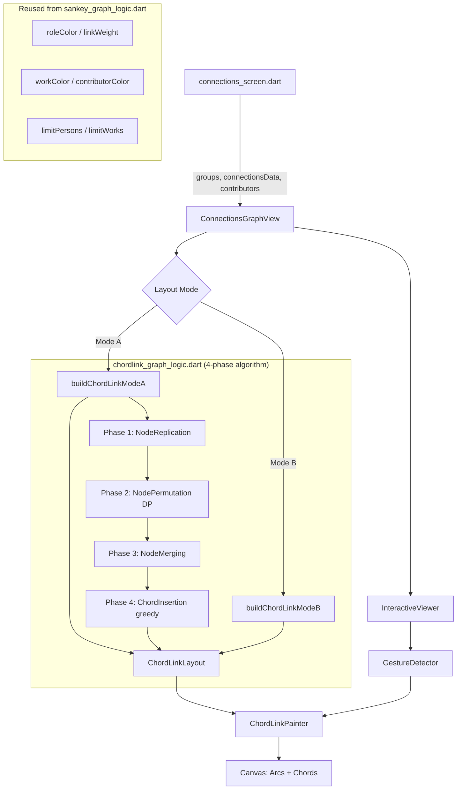

# Design Document: ChordLink Connections Graph

## Overview

This design replaces the existing Sankey diagram visualization in `ConnectionsGraphView` with a ChordLink-style hybrid circular diagram, adapted from the ChordLink model (Angori et al., GD 2019). Nodes are rendered as colored arcs on a circle's perimeter, grouped into clusters by type (People, Works, Contributors). Relationships are drawn as Bézier chords through the circle's interior.

The adaptation simplifies the full ChordLink algorithm for our bipartite graph structure: since people connect to works and works connect to contributors (no intra-cluster edges), all edges are cross-cluster. The 4-phase ChordLink strategy (NodeReplication → NodePermutation → NodeMerging → ChordInsertion) is applied to arrange node copies on the circumference and assign chords to minimize crossings.

### Key Design Decisions

1. **New layout logic file**: `lib/logic/chordlink_graph_logic.dart` contains the pure layout algorithm (4-phase ChordLink computation). The existing `sankey_graph_logic.dart` is preserved — its helper functions (`roleColor`, `linkWeight`, `workColor`, `contributorColor`, `limitPersons`, `limitWorks`) are reused by the new logic.
2. **CustomPainter rendering**: The circular diagram is drawn via a `CustomPainter` subclass, replacing the `sankey_flutter` package dependency for this widget. `InteractiveViewer` provides zoom/pan.
3. **Tighter node limits**: Reduced from 50/30 (Sankey) to 25/20 (ChordLink) for readability in a circular layout.
4. **No new providers**: The widget receives the same data (`List<UnfollowedPersonGroup>`, `ConnectionsData?`, `List<Contributor>?`) from the parent screen. Layout computation is a pure function of this input.
5. **Same constructor contract**: `ConnectionsGraphView` keeps its existing constructor signature, so `connections_screen.dart` requires no changes beyond the import.

## Architecture



The data flow is:

1. **connections_screen.dart** watches providers and passes data to `ConnectionsGraphView`.
2. **ConnectionsGraphView** is a `StatefulWidget` managing layout mode toggle, selected node state, and the `InteractiveViewer` transform.
3. **chordlink_graph_logic.dart** runs the 4-phase algorithm as a pure function, producing a `ChordLinkLayout` containing positioned arcs and chords.
4. **ChordLinkPainter** (`CustomPainter`) draws arcs and chords on the canvas. Hit-testing for node selection is done via `GestureDetector` + angle/radius math.

### File Changes

| File | Action | Purpose |
|------|--------|---------|
| `lib/logic/chordlink_graph_logic.dart` | **New** | ChordLink layout algorithm (4 phases), data structures, builders |
| `lib/ui/common/connections_graph_view.dart` | **Rewrite** | ChordLink widget with CustomPainter, InteractiveViewer, legend |
| `lib/logic/sankey_graph_logic.dart` | **Unchanged** | Helper functions reused via import |

## Components and Interfaces

### Data Structures (in `chordlink_graph_logic.dart`)

```dart
/// Layout modes for the ChordLink diagram.
enum ChordLinkLayoutMode {
  peopleAndWorks,  // Mode A: 2-cluster
  fullBridge,      // Mode B: 3-cluster
}

/// The type of a node cluster.
enum ClusterType { people, works, contributors }

/// A logical node before replication — represents one entity.
class ChordLinkNode {
  final String id;          // e.g. "person_123", "work_456_movie"
  final String label;
  final ClusterType cluster;
  final Color color;
  final double totalWeight; // sum of chord weights incident to this node
}

/// A single arc on the circumference (may be one of several copies of a node).
class ChordLinkArc {
  final String nodeId;      // references ChordLinkNode.id
  final int copyIndex;      // 0-based copy index for this node
  final ClusterType cluster;
  final Color color;
  final double startAngle;  // radians, set during layout
  final double sweepAngle;  // radians, set during layout
  final String? label;      // non-null only for the longest arc copy
}

/// A chord connecting two arcs through the circle interior.
class ChordLinkChord {
  final String sourceNodeId;
  final String targetNodeId;
  final int sourceArcIndex; // which copy of source
  final int targetArcIndex; // which copy of target
  final double weight;      // determines thickness
  final Color sourceColor;
  final Color targetColor;
  /// Positions along the source/target arcs (set during ChordInsertion).
  final double sourceAngle; // radians — point on source arc
  final double targetAngle; // radians — point on target arc
}

/// The complete layout output from the 4-phase algorithm.
class ChordLinkLayout {
  final List<ChordLinkArc> arcs;
  final List<ChordLinkChord> chords;
  final Map<ClusterType, ({double startAngle, double sweepAngle})> clusterSpans;
  final double radius;
  /// Metadata for limit labels.
  final bool personsLimited;
  final int totalPersons;
  final bool worksLimited;
  final int totalWorks;
}
```

### 4-Phase Algorithm (in `chordlink_graph_logic.dart`)

#### Phase 1: NodeReplication

```dart
/// For each node, determine how many copies it needs on the circumference.
/// An extrovert node (connected to nodes in other clusters) gets one copy
/// per distinct external neighbor. An introvert node gets exactly one copy.
///
/// In our bipartite structure:
/// - Person nodes connect only to Work nodes → extrovert, copies = number of works
/// - Work nodes connect to Person nodes (and Contributors in Mode B) → extrovert
/// - Contributor nodes connect only to Work nodes → extrovert
///
/// To keep the diagram readable, copies are capped: a node with N external
/// neighbors gets min(N, 3) copies. Nodes with ≤2 neighbors get 1 copy.
List<_NodeCopy> replicateNodes(List<ChordLinkNode> nodes, List<_EdgeRecord> edges)
```

#### Phase 2: NodePermutation (DP)

```dart
/// Permute copies within each cluster to minimize the number of
/// non-consecutive copies of the same node.
///
/// Uses the DP recurrence from the ChordLink paper:
///   O_i(v_{i,j}, v_{i,z}) = O_{i+1}(v_{i+1,j'}, v_{i+1,z'})
///                           + (0 if v_{i+1,j'} == v_{i,z}, else 1)
///
/// For each group of copies attached to the same external neighbor,
/// find optimal first/last elements. O(m^3) where m = edges in cluster.
///
/// Since our node limits cap at 25 people × 20 works = 500 edges max,
/// and copies are capped at 3, the DP is tractable.
List<_NodeCopy> permuteNodeCopies(List<_NodeCopy> copies, List<_EdgeRecord> edges)
```

#### Phase 3: NodeMerging

```dart
/// For each maximal subsequence of consecutive copies of the same node,
/// merge them into a single wider arc spanning the combined angular space.
/// Returns the final list of ChordLinkArc with computed angles.
List<ChordLinkArc> mergeConsecutiveCopies(
  List<_NodeCopy> permutedCopies,
  Map<ClusterType, double> clusterStartAngles,
  Map<ClusterType, double> clusterSweepAngles,
)
```

#### Phase 4: ChordInsertion (Greedy)

```dart
/// Assign each edge to specific arc copies and compute chord positions.
///
/// 1. For edges where both endpoints have exactly one arc (E1), assign directly.
/// 2. For edges where at least one endpoint has multiple arcs (E2), use a
///    greedy algorithm: for each edge, try all valid (sourceArc, targetArc)
///    pairs and pick the one that minimizes the crossing cost function:
///      α(S) = Σ α(e_wz, e_xy)
///      where α = 0 if chords don't cross,
///            α = 1 - a(wz,xy)/π if they do cross (a = min crossing angle)
/// 3. Distribute multiple chords incident to the same arc equally along it.
List<ChordLinkChord> insertChords(
  List<ChordLinkArc> arcs,
  List<_EdgeRecord> edges,
)
```

#### Top-Level Builders

```dart
/// Build ChordLink layout for Mode A (People + Works).
/// Applies limitPersons(25) and limitWorks(20), then runs 4-phase algorithm.
ChordLinkLayout buildChordLinkModeA(
  List<UnfollowedPersonGroup> groups,
  ColorScheme colorScheme,
)

/// Build ChordLink layout for Mode B (People + Works + Contributors).
/// Extends Mode A with contributor cluster and work→contributor chords.
ChordLinkLayout buildChordLinkModeB(
  List<UnfollowedPersonGroup> groups,
  ConnectionsData connectionsData,
  List<Contributor> contributors,
  ColorScheme colorScheme,
)
```

### ConnectionsGraphView Widget (rewritten `connections_graph_view.dart`)

```dart
class ConnectionsGraphView extends StatefulWidget {
  final List<UnfollowedPersonGroup> groups;
  final ConnectionsData? connectionsData;
  final List<Contributor>? contributors;

  const ConnectionsGraphView({
    super.key,
    required this.groups,
    this.connectionsData,
    this.contributors,
  });
}
```

**State:**
- `_layoutMode`: `ChordLinkLayoutMode` — defaults to `peopleAndWorks`.
- `_selectedNodeId`: `String?` — the ID of the currently tapped node.
- `_legendExpanded`: `bool` — whether the legend is expanded (default: true).

**Build method:**
1. Empty/minimal state checks → placeholder messages.
2. Layout mode toggle (`SegmentedButton`).
3. Limit labels (if applicable).
4. `LayoutBuilder` → compute radius → call `buildChordLinkModeA/B` → wrap `CustomPaint` in `InteractiveViewer` + `GestureDetector`.
5. Collapsible legend below the diagram.

### ChordLinkPainter (CustomPainter)

```dart
class ChordLinkPainter extends CustomPainter {
  final ChordLinkLayout layout;
  final String? selectedNodeId;
  final Brightness brightness; // for theme-aware rendering

  @override
  void paint(Canvas canvas, Size size) {
    // 1. Draw arcs as filled arc segments on the perimeter.
    // 2. Draw chords as cubic Bézier curves through the center.
    //    - Gradient shader from source color to target color.
    //    - Semi-transparent (opacity 0.3–0.6).
    //    - When a node is selected: connected chords at full opacity,
    //      unrelated chords/arcs at 0.1 opacity.
    // 3. Draw cluster labels outside the circle.
    // 4. Draw node label near selected node (tooltip).
  }

  @override
  bool shouldRepaint(ChordLinkPainter oldDelegate) =>
      layout != oldDelegate.layout ||
      selectedNodeId != oldDelegate.selectedNodeId;
}
```

### Hit Testing for Node Selection

```dart
/// Given a tap position relative to the CustomPaint widget center,
/// determine which node (if any) was tapped by checking if the tap
/// falls within the arc ring (radius ± arcThickness/2) and within
/// any arc's angular range.
String? hitTestNode(Offset tapPosition, ChordLinkLayout layout, Offset center)
```

### Circle Sizing

```dart
/// Radius = min(availableWidth, availableHeight) / 2 - labelPadding
/// where labelPadding = 40.0 (space for cluster labels outside the circle).
double computeRadius(double availableWidth, double availableHeight) {
  const labelPadding = 40.0;
  return (min(availableWidth, availableHeight) / 2) - labelPadding;
}
```

## Data Models

No new persistent data models are needed. The feature uses existing domain models and introduces layout-only data structures (defined above in Components) that exist only during rendering.

### Existing Models Used

| Model | Source | Purpose |
|-------|--------|---------|
| `UnfollowedPersonGroup` | `connections_models.dart` | Person nodes + person→work edges |
| `UnfollowedPersonWork` | `connections_models.dart` | Work metadata + role importance per edge |
| `ConnectionsData` | `connections_models.dart` | Watchlist connections with `matchedContributors` for Mode B |
| `ConnectionWork` | `connections_models.dart` | Work→contributor relationships for Mode B |
| `MatchedContributor` | `connections_models.dart` | Followed contributor info per work |
| `Contributor` | `contributor.dart` | Contributor name/profile for Mode B nodes |

### Reused Functions from `sankey_graph_logic.dart`

| Function | Purpose |
|----------|---------|
| `roleColor(int importance)` | Maps role importance 0–7 to a color |
| `linkWeight(int roleImportance)` | Returns `(8 - importance).clamp(1, 8)` |
| `workColor(WorkType, ColorScheme)` | Movie → tertiary, TV → cyan |
| `contributorColor(ColorScheme)` | → primary color |
| `limitPersons(groups, max)` | Top N persons by work count |
| `limitWorks(groups, max)` | Top N works by person count |

### Layout Mode Enum

```dart
enum ChordLinkLayoutMode {
  peopleAndWorks,  // Mode A: 2-cluster (People, Works)
  fullBridge,      // Mode B: 3-cluster (People, Works, Contributors)
}
```

### Cluster Angular Layout

The circle is divided into cluster segments separated by gaps:

- **Mode A**: 2 clusters, 2 gaps of 5° each → 350° available for arcs.
- **Mode B**: 3 clusters, 3 gaps of 5° each → 345° available for arcs.

Each cluster's angular span is proportional to the total chord weight of all nodes in that cluster. Within a cluster, each arc's angular span is proportional to its node's total chord weight, with a minimum of 1° per arc.

### Mode B Data Resolution

Same as the Sankey design: work→contributor links are resolved by matching `UnfollowedPersonWork.tmdbId` against `ConnectionWork.tmdbId` in `ConnectionsData.watchlistConnections`. Only contributors reachable through displayed works appear as nodes.


## Correctness Properties

*A property is a characteristic or behavior that should hold true across all valid executions of a system — essentially, a formal statement about what the system should do. Properties serve as the bridge between human-readable specifications and machine-verifiable correctness guarantees.*

### Property 1: Cluster type correctness

*For any* input data, the Mode A layout output should contain arcs belonging to exactly the cluster types `{people, works}`. *For any* input data with reachable contributors, the Mode B layout output should contain arcs belonging to exactly `{people, works, contributors}`.

**Validates: Requirements 1.2, 1.3**

### Property 2: Cluster gap minimum

*For any* layout output, the angular gap between the end of one cluster's last arc and the start of the next cluster's first arc (in circular order) should be at least 5 degrees (π/36 radians).

**Validates: Requirements 1.4**

### Property 3: Arc angular size proportional to weight

*For any* two arcs within the same cluster in a layout output, the ratio of their sweep angles should equal the ratio of their nodes' total chord weights, within a tolerance that accounts for the 1-degree minimum arc size constraint.

**Validates: Requirements 1.5**

### Property 4: Arc minimum angular size

*For any* layout output, every arc should have a sweep angle of at least 1 degree (π/180 radians).

**Validates: Requirements 1.6**

### Property 5: Circumference partition

*For any* layout output, the sum of all arc sweep angles plus all cluster gap angles should equal 2π (full circle), within floating-point tolerance.

**Validates: Requirements 1.7**

### Property 6: Arc copies share same color

*For any* layout output, all arcs sharing the same `nodeId` should have the same `color`.

**Validates: Requirements 2.1, 4.4**

### Property 7: Node replication count

*For any* node in the input graph, the number of arc copies in the layout output should equal `min(distinctExternalNeighbors, 3)` when `distinctExternalNeighbors > 2`, and `1` otherwise.

**Validates: Requirements 2.3**

### Property 8: Consecutive copy merging

*For any* layout output, if a node has multiple arcs, there should be no interleaving — i.e., there should be no arc of a different node between two arcs of the same node within the same cluster's angular range. (All copies of a node are consecutive after merging.)

**Validates: Requirements 2.4**

### Property 9: Label on longest arc

*For any* node with multiple arcs in the layout output, exactly one arc should have a non-null `label`, and it should be the arc with the largest `sweepAngle`.

**Validates: Requirements 2.5**

### Property 10: Chord count equals edge count

*For any* input data (after node limiting), the number of chords in the layout output should equal the number of (person, work) pairs within the allowed node sets (Mode A), or the number of (person, work) + (work, contributor) pairs (Mode B).

**Validates: Requirements 3.1, 5.3**

### Property 11: Chord colors match node colors

*For any* chord in the layout output, its `sourceColor` should equal the color of the arc referenced by `sourceNodeId`, and its `targetColor` should equal the color of the arc referenced by `targetNodeId`.

**Validates: Requirements 3.5**

### Property 12: Chords equally distributed along arc

*For any* arc with N ≥ 2 incident chords, the chord attachment angles should be evenly spaced within the arc's angular range. Specifically, the spacing between consecutive chord angles should be equal (within floating-point tolerance).

**Validates: Requirements 3.6**

### Property 13: Node coloring matches type functions

*For any* person node in the layout, its color should equal `roleColor(bestRoleImportance)`. *For any* work node, its color should equal `workColor(workType, colorScheme)`. *For any* contributor node, its color should equal `contributorColor(colorScheme)`.

**Validates: Requirements 4.1, 4.2, 4.3**

### Property 14: Person node set correctness after limiting

*For any* input with more than 25 unfollowed person groups, the layout output should contain exactly 25 distinct person `nodeId`s, and they should correspond to the 25 groups with the highest work counts. *For any* input with ≤25 groups, all groups should appear.

**Validates: Requirements 5.1, 11.1**

### Property 15: Work node set correctness after limiting

*For any* input where the distinct work count exceeds 20 (after person limiting), the layout output should contain exactly 20 distinct work `nodeId`s, corresponding to the 20 works with the most person connections. *For any* input with ≤20 distinct works, all works should appear.

**Validates: Requirements 5.2, 11.2**

### Property 16: Mode B person and work data is superset of Mode A

*For any* input data, the set of person `nodeId`s and work `nodeId`s in the Mode B layout should be identical to those in the Mode A layout. The set of person→work chords (by sourceNodeId, targetNodeId) should also be identical.

**Validates: Requirements 6.1**

### Property 17: Work-to-contributor chord count

*For any* input data with `ConnectionsData`, the number of work→contributor chords in Mode B should equal the number of `(work, matchedContributor)` pairs where the work is in the displayed work set.

**Validates: Requirements 6.2**

### Property 18: Unreachable contributors excluded

*For any* contributor node in the Mode B layout output, there should exist at least one work in the displayed work set whose `matchedContributors` references that contributor. No contributor without an overlapping displayed work should appear.

**Validates: Requirements 6.4**

### Property 19: Selection highlights correct arcs and chords

*For any* layout and any selected `nodeId`, the set of highlighted arcs should be exactly those arcs whose `nodeId` matches the selected node, and the set of highlighted chords should be exactly those chords where `sourceNodeId` or `targetNodeId` matches the selected node.

**Validates: Requirements 8.1, 8.2**

### Property 20: Hit-test returns correct node for arc taps

*For any* layout and any point within the arc ring (radius ± arcThickness/2) that falls within an arc's angular range, the hit-test function should return that arc's `nodeId`. *For any* point outside all arc regions, the hit-test function should return null.

**Validates: Requirements 8.4**

### Property 21: Radius computation

*For any* positive `availableWidth` and `availableHeight`, `computeRadius(w, h)` should return `min(w, h) / 2 - 40.0`.

**Validates: Requirements 9.4**

## Error Handling

| Scenario | Handling |
|----------|----------|
| Empty `groups` list | Show centered "No unfollowed connections to visualize" message. No diagram rendered. |
| Fewer than 2 person nodes after limiting | Show centered "Not enough connections for a diagram view" message. |
| `connectionsData` or `contributors` is null when Mode B selected | Fall back to Mode A silently. Mode B toggle disabled when data unavailable. |
| Layout computation throws | Wrap in try/catch. Show "Unable to render diagram" with error details. |
| Zero-weight node (no chords) | Assign minimum arc size of 1 degree. Node still visible but minimal. |
| All copies of a node non-consecutive after permutation | Merging phase handles this gracefully — non-consecutive copies remain as separate arcs. |

## Testing Strategy

### Property-Based Testing

Use the `glados` package (already in dev dependencies) for property-based testing in Dart. Each property test should run a minimum of 100 iterations with randomly generated input data.

The layout algorithm functions in `chordlink_graph_logic.dart` are pure functions and directly testable without widget instantiation. The test file should be `test/logic/chordlink_graph_logic_test.dart`.

**Tag format:** Each property test should include a comment referencing the design property:
```dart
// Feature: chordlink-connections-graph, Property 1: Cluster type correctness
```

**Test generators needed:**
- `UnfollowedPersonGroup` generator: random person ID, name, 1–5 works with random tmdbId/type/role/importance. Reuse the pattern from `sankey_graph_logic_test.dart`.
- `ConnectionsData` generator (for Mode B): random watchlist connections with 1–3 matched contributors per work.
- `Contributor` generator: random contributor with ID and name.
- `ChordLinkLayout` generator (for hit-test and selection properties): generate layouts with known arc positions.

**Property test grouping:**
- Properties 1–9: Layout structure invariants (test `replicateNodes`, `permuteNodeCopies`, `mergeConsecutiveCopies`, and the full pipeline).
- Properties 10–18: Data construction correctness (test `buildChordLinkModeA`, `buildChordLinkModeB`).
- Properties 19–20: Interaction logic (test `hitTestNode` and selection filtering).
- Property 21: Utility function (test `computeRadius`).

### Unit Testing

Unit tests complement property tests for specific examples and edge cases:

- **Empty input**: Verify empty groups produce no arcs/chords.
- **Single person, 1 work**: Verify minimal valid layout (2 arcs, 1 chord).
- **Mode B with no overlapping contributors**: Verify zero contributor arcs.
- **Node limit boundary**: Verify exactly 25 persons / 20 works at the limit.
- **All copies consecutive**: Verify merging produces a single wider arc.
- **Non-consecutive copies**: Verify separate arcs are preserved.
- **Hit-test on gap**: Verify null return for taps in cluster gaps.
- **Hit-test on arc boundary**: Verify correct node at exact arc start/end angles.

### Widget Testing

Widget tests verify UI integration:

- Toggle between Mode A and Mode B updates the diagram.
- Empty state shows the placeholder message.
- Legend expands and collapses.
- InteractiveViewer allows zoom within 0.5x–3.0x bounds.
- Node tap triggers selection state change.
- Tap on empty space clears selection.
