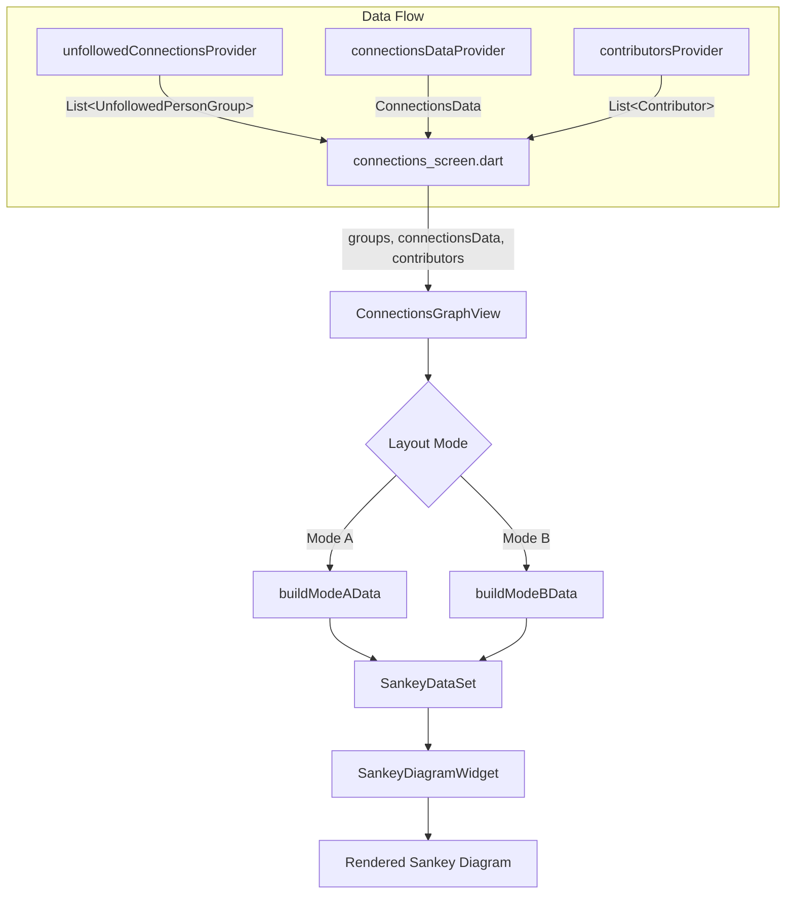

# Design Document: Connections Graph (Sankey Diagram)

## Overview

This design describes the implementation of a Sankey diagram visualization for the "All Connections" tab on the Connections screen. The existing `ConnectionsGraphView` widget file (`lib/ui/common/connections_graph_view.dart`) will be rewritten to use the `sankey_flutter` package instead of the unimplemented force-directed graph approach.

The widget transforms `List<UnfollowedPersonGroup>` data (and optionally followed contributor data) into `SankeyNode`/`SankeyLink` structures, then renders them via `SankeyDiagramWidget`. Two layout modes are supported:

- **Mode A (People → Works)**: 2-column bipartite layout showing unfollowed people flowing to watchlist works.
- **Mode B (People → Works → Contributors)**: 3-column bridge layout adding followed contributors as a third column.

The toggle between list and graph views already exists in `connections_screen.dart` (`_showGraph` state). The graph widget receives data through its constructor and is stateless with respect to data fetching — all data comes from the parent screen via providers.

### Key Design Decisions

1. **Pure data transformation, no new providers**: The Sankey node/link construction is a pure function of the input data. No new Riverpod providers are needed — the widget receives `List<UnfollowedPersonGroup>` (already available) plus `ConnectionsData` and `List<Contributor>` for Mode B.
2. **Node limits applied before layout**: To keep the diagram responsive, person and work nodes are capped (50 people, 30 works) before building the Sankey data set. This avoids computing layout for hundreds of nodes.
3. **`sankey_flutter` package**: Uses `SankeyDiagramWidget` for rendering, `SankeyNode`/`SankeyLink`/`SankeyDataSet` for data, and `generateSankeyLayout` for layout computation. The package handles gradient links and node selection callbacks natively.
4. **Rewrite of existing file**: The current `_GraphNode`/`_GraphEdge` classes and `_roleColor` function in `connections_graph_view.dart` are replaced entirely. The `_roleColor` function is preserved (same logic, same colors) as it maps role importance to node colors.

## Architecture



The architecture is a simple data transformation pipeline:

1. **connections_screen.dart** watches three providers and passes data to `ConnectionsGraphView`.
2. **ConnectionsGraphView** is a `StatefulWidget` managing only the layout mode toggle and selected node state.
3. **Data transformation functions** (`_buildModeAData`, `_buildModeBData`) are pure functions that convert domain models into `SankeyNode`/`SankeyLink` lists.
4. **`SankeyDiagramWidget`** handles all rendering, layout, and interaction (node selection via `onNodeSelected`).

### Integration with Connections Screen

The existing `_buildAllConnectionsList()` method in `connections_screen.dart` currently passes only `groups` to `ConnectionsGraphView`. For Mode B support, the constructor call will be expanded:

```dart
ConnectionsGraphView(
  groups: groups,
  connectionsData: connectionsData,  // for Mode B work→contributor links
  contributors: contributors,         // for Mode B contributor nodes
)
```

The `connectionsData` and `contributors` are already watched by the connections screen (via `connectionsDataProvider` and `contributorsProvider`). The screen will pass them through when available.

## Components and Interfaces

### ConnectionsGraphView Widget

```dart
class ConnectionsGraphView extends StatefulWidget {
  final List<UnfollowedPersonGroup> groups;
  final ConnectionsData? connectionsData;
  final List<Contributor>? contributors;

  const ConnectionsGraphView({
    super.key,
    required this.groups,
    this.connectionsData,
    this.contributors,
  });
}
```

**State:**
- `_layoutMode`: enum `SankeyLayoutMode { peopleAndWorks, fullBridge }` — defaults to `peopleAndWorks`.
- `_selectedNodeId`: `String?` — the ID of the currently tapped node (for highlight/dim).

**Build method structure:**
1. Check for empty/minimal data → show placeholder message.
2. Render layout mode toggle (`SegmentedButton`).
3. Build Sankey data via `_buildSankeyData()`.
4. Wrap `SankeyDiagramWidget` in `SingleChildScrollView` (both axes) with computed dimensions.

### Data Transformation Functions

```dart
/// Applies node limits and builds the SankeyDataSet for the current mode.
SankeyDataSet _buildSankeyData(SankeyLayoutMode mode, BoxConstraints constraints)

/// Mode A: People → Works (2-column bipartite)
({List<SankeyNode> nodes, List<SankeyLink> links}) _buildModeAData(
  List<UnfollowedPersonGroup> groups,
)

/// Mode B: People → Works → Contributors (3-column bridge)
({List<SankeyNode> nodes, List<SankeyLink> links}) _buildModeBData(
  List<UnfollowedPersonGroup> groups,
  ConnectionsData connectionsData,
  List<Contributor> contributors,
)
```

### Node ID Convention

Node IDs are strings with a type prefix to avoid collisions between people, works, and contributors that might share TMDB IDs:

- Person nodes: `"person_<contributorId>"`
- Work nodes: `"work_<tmdbId>_<type>"` (type is `movie` or `tvShow`)
- Contributor nodes: `"contributor_<contributorId>"`

### Node Coloring

```dart
/// Preserved from existing code — maps role importance (0–7) to a color.
Color _roleColor(int importance)

/// Work node color based on type.
Color _workColor(WorkType type, ColorScheme colorScheme)
// movie → colorScheme.tertiary (amber-ish in default theme)
// tvShow → Colors.cyan

/// Contributor node color (Mode B only).
Color _contributorColor(ColorScheme colorScheme)
// → colorScheme.primary
```

### Link Weight Calculation

Link weight (which controls thickness) is derived from role importance, inverted so that more important roles produce thicker links:

```dart
double _linkWeight(int roleImportance) {
  // roleImportance: 0=Director(most important) ... 7=Crew(least)
  // weight: 8=Director(thickest) ... 1=Crew(thinnest)
  return (8 - roleImportance).clamp(1, 8).toDouble();
}
```

### Node Limiting

Before building Sankey data, the input is trimmed:

```dart
/// Returns the top N persons by work count (descending).
List<UnfollowedPersonGroup> _limitPersons(List<UnfollowedPersonGroup> groups, int max)

/// After person limiting, collects all referenced works and limits to top N
/// by number of person connections (descending).
Set<String> _limitWorks(List<UnfollowedPersonGroup> groups, int max)
```

When limits are applied, a label is shown above the diagram: "Showing top 50 of N people" / "Showing top 30 of N works".

### Diagram Sizing

```dart
double _computeHeight(int tallestColumnNodeCount) {
  return max(400.0, tallestColumnNodeCount * 40.0);
}

double _computeWidth(SankeyLayoutMode mode, double viewportWidth) {
  return mode == SankeyLayoutMode.fullBridge
      ? viewportWidth * 1.5
      : viewportWidth;
}
```

### Node Selection / Highlighting

The `SankeyDiagramWidget`'s `onNodeSelected` callback sets `_selectedNodeId`. The widget uses the package's built-in selection highlighting — when a node is selected, connected links are highlighted and unrelated elements are dimmed. Tapping empty space clears the selection.

## Data Models

No new persistent data models are needed. The feature uses existing domain models and the `sankey_flutter` package's built-in types.

### Existing Models Used

| Model | Source | Purpose |
|-------|--------|---------|
| `UnfollowedPersonGroup` | `connections_models.dart` | Person nodes + person→work links |
| `UnfollowedPersonWork` | `connections_models.dart` | Work metadata + role importance per link |
| `ConnectionsData` | `connections_models.dart` | Watchlist connections with `matchedContributors` for Mode B |
| `ConnectionWork` | `connections_models.dart` | Work→contributor relationships for Mode B |
| `MatchedContributor` | `connections_models.dart` | Followed contributor info per work |
| `Contributor` | `contributor.dart` | Contributor name/profile for Mode B nodes |

### sankey_flutter Package Types

| Type | Usage |
|------|-------|
| `SankeyNode` | Represents a person, work, or contributor node |
| `SankeyLink` | Represents a flow connection between two nodes |
| `SankeyDataSet` | Container for nodes + links, passed to layout |
| `SankeyDiagramWidget` | The rendering widget |

### Layout Mode Enum (new, local to widget file)

```dart
enum SankeyLayoutMode {
  peopleAndWorks,  // Mode A: 2-column
  fullBridge,      // Mode B: 3-column
}
```

### Mode B Data Resolution

For Mode B, the work→contributor links are resolved by matching `UnfollowedPersonWork.tmdbId` against `ConnectionWork.tmdbId` in `ConnectionsData.watchlistConnections`. Each `ConnectionWork` has a `matchedContributors` list containing the followed contributors and their roles in that work. Only contributors who appear in works that are also referenced by at least one unfollowed person are included as Contributor_Nodes.

```
UnfollowedPersonGroup.works[i].tmdbId  →  match  →  ConnectionWork.tmdbId
                                                      └── matchedContributors[j]
                                                           ├── contributorId  →  Contributor_Node
                                                           └── roleImportance →  link weight
```


## Correctness Properties

*A property is a characteristic or behavior that should hold true across all valid executions of a system — essentially, a formal statement about what the system should do. Properties serve as the bridge between human-readable specifications and machine-verifiable correctness guarantees.*

### Property 1: Mode A node counts match input data

*For any* list of `UnfollowedPersonGroup` (after applying node limits), the Mode A data builder should produce exactly one person node per group and exactly one work node per distinct `(tmdbId, type)` pair across all groups' works.

**Validates: Requirements 1.1, 1.2**

### Property 2: Mode A link count equals total person-work relationships

*For any* list of `UnfollowedPersonGroup` (after applying node limits and work limits), the Mode A data builder should produce exactly one link for each (person, work) pair where the work is within the allowed work set. The total link count equals the sum of each person's works that pass the work limit filter.

**Validates: Requirements 1.3**

### Property 3: Link weight is inversely proportional to role importance

*For any* role importance value in the range [0, 7], the link weight function should return `(8 - roleImportance)`, producing values in [1, 8] where lower importance numbers (more important roles) yield higher weights (thicker links).

**Validates: Requirements 1.4, 2.4**

### Property 4: Node coloring is deterministic based on node type and role importance

*For any* person node, its color should equal `_roleColor(bestRoleImportance)`. *For any* work node, its color should be determined solely by its `WorkType` (movie vs tvShow). The same inputs always produce the same colors.

**Validates: Requirements 1.5, 1.6**

### Property 5: Mode B person-to-work links are identical to Mode A

*For any* input data, the set of person→work links (source ID, target ID, weight) produced by Mode B should be exactly equal to the set produced by Mode A for the same input groups.

**Validates: Requirements 2.2**

### Property 6: Mode B work-to-contributor links match contributor associations

*For any* input data with `ConnectionsData` containing watchlist connections, the Mode B data builder should produce one work→contributor link for each `(work, matchedContributor)` pair where the work is also referenced by at least one unfollowed person in the displayed set. The link weight should equal `_linkWeight(matchedContributor.roleImportance)`.

**Validates: Requirements 2.3**

### Property 7: Only reachable contributors appear as nodes in Mode B

*For any* set of followed contributors and unfollowed person groups, a contributor should appear as a Contributor_Node if and only if at least one of their associated works (from `ConnectionsData.watchlistConnections`) is also referenced by at least one displayed unfollowed person.

**Validates: Requirements 2.6**

### Property 8: Node labels match entity names

*For any* Sankey node in the output, the node's label should equal the corresponding entity's display name: `UnfollowedPersonGroup.name` for person nodes, `UnfollowedPersonWork.title` for work nodes, and `Contributor.name` for contributor nodes.

**Validates: Requirements 4.2**

### Property 9: Diagram sizing follows node count formulas

*For any* node count and viewport dimensions, the computed diagram height should equal `max(400.0, tallestColumnNodeCount * 40.0)`, and the computed width should equal the viewport width for Mode A or `1.5 × viewportWidth` for Mode B.

**Validates: Requirements 7.3, 7.4**

### Property 10: Node limiting preserves top-ranked entries

*For any* list of `UnfollowedPersonGroup` with more than 50 entries, the limiting function should return exactly 50 groups, and they should be the 50 with the highest work counts (descending). *For any* set of distinct works exceeding 30, the limiting function should return exactly 30 works, and they should be the 30 with the most unfollowed people appearing in them (descending).

**Validates: Requirements 8.1, 8.2**

## Error Handling

| Scenario | Handling |
|----------|----------|
| Empty `groups` list | Show centered "No unfollowed connections to visualize" message. No diagram rendered. |
| Fewer than 2 person nodes after limiting | Show centered "Not enough connections for a diagram view" message. |
| `connectionsData` or `contributors` is null when Mode B selected | Fall back to Mode A silently. The toggle for Mode B can be disabled or hidden when data is unavailable. |
| `sankey_flutter` layout throws | Wrap layout computation in try/catch. On error, show "Unable to render diagram" message with option to switch to list view. |
| Node ID collision (theoretically impossible due to prefix convention) | The prefix convention (`person_`, `work_`, `contributor_`) prevents collisions by design. |

## Testing Strategy

### Property-Based Testing

Use the `dart_quickcheck` or `glados` package for property-based testing in Dart. Each property test should run a minimum of 100 iterations with randomly generated input data.

The data transformation functions (`_buildModeAData`, `_buildModeBData`, `_linkWeight`, `_limitPersons`, `_limitWorks`, `_computeHeight`, `_computeWidth`) should be extracted as top-level or static functions (not private widget methods) to enable direct unit and property testing without widget instantiation.

**Tag format:** Each property test should include a comment referencing the design property:
```dart
// Feature: connections-graph, Property 1: Mode A node counts match input data
```

**Test generators needed:**
- `UnfollowedPersonGroup` generator: random person ID, name, 2–10 works with random tmdbId/type/role/importance.
- `ConnectionsData` generator (for Mode B): random watchlist connections with matched contributors.
- `Contributor` generator: random contributor with ID and name.

### Unit Testing

Unit tests complement property tests for specific examples and edge cases:

- **Empty input**: Verify empty groups produce no nodes/links.
- **Single person, 2 works**: Verify exact node/link structure for minimal valid input.
- **Mode B with no overlapping contributors**: Verify zero contributor nodes.
- **Node limit boundary**: Verify exactly 50 persons / 30 works when input is at the limit.
- **Role importance edge values**: Verify `_linkWeight(0)` = 8, `_linkWeight(7)` = 1.
- **Duplicate work deduplication**: Two persons sharing the same work should produce one work node, not two.

### Widget Testing

Widget tests verify the UI integration:

- Toggle between Mode A and Mode B updates the diagram.
- Empty state shows the placeholder message.
- List/graph toggle switches between `ListView` and `ConnectionsGraphView`.
