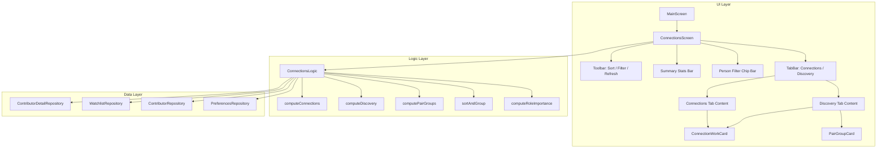

# Design Document: Connections

## Overview

The Connections feature adds a new top-level screen to the app's sidebar navigation that surfaces movies and TV shows where two or more followed contributors overlap. It uses the same TabBar/TabBarView pattern as the Following screen's People/Watchlist tabs, with two tabs:

- **Connections tab** — works already on the user's watchlist with 2+ followed contributors.
- **Discovery tab** — works from contributor filmographies (not on the watchlist) with 2+ followed contributors.

The toolbar (with display options, refresh, and summary stats) and the person filter chip bar sit above the TabBar, shared across both tabs — mirroring how the Following screen's AppBar toolbar sits above its People/Watchlist tabs. Each tab has its own scrollable content area within the TabBarView.

The default tab is Connections. However, if the Connections tab is empty (zero watchlist works with 2+ connections) and the Discovery tab has results, the initial tab index is set to Discovery instead. If both are empty, it stays on Connections. This is computed once during `initState` from the `ConnectionsData` and does not override subsequent user tab selections.

The feature operates entirely on locally cached data (ContributorDetail, WatchlistEntry) and makes zero TMDB API calls during normal use. A manual refresh button triggers the existing `refreshAllContributors()` flow when the user wants fresher data.

The screen includes sorting/grouping options, a person filter chip bar, pair collapsing for Discovery, summary stats, and four distinct TV show presentation cases based on episode-level connection depth.

## Architecture

The feature follows the existing app architecture:

- **State Management**: Flutter Riverpod providers, consistent with the rest of the app.
- **Data Layer**: Reads from Hive-backed repositories (ContributorDetailRepository, WatchlistRepository, ContributorRepository). No new Hive boxes are needed.
- **Logic Layer**: A new `ConnectionsLogic` class encapsulates all connection computation, sorting, filtering, and pair collapsing.
- **UI Layer**: A new `ConnectionsScreen` widget with supporting card widgets, integrated into the `AdaptiveScaffold` via `MainScreen`.
- **Preferences**: New fields on the existing `Preferences` Hive model for persisting sort/group/toggle state.



### Data Flow

1. `ConnectionsScreen` reads followed contributors from `ContributorRepository` and their cached details from `ContributorDetailRepository`.
2. `ConnectionsLogic.computeConnections()` cross-references all works from all ContributorDetail.allWorks lists, building a map of `(tmdbId, WorkType) → Set<ContributorId>`. Works with 2+ contributors that are on the watchlist go to the Connections section.
3. `ConnectionsLogic.computeDiscovery()` takes the remaining works with 2+ contributors (not on watchlist) and applies pair collapsing.
4. Sorting, filtering, and grouping are applied as a final pass before the UI renders.
5. The refresh button calls `ContributorLogic.refreshAllContributors()` with a progress callback, then invalidates the relevant providers to trigger recomputation.

## Components and Interfaces

### New Files

| File | Purpose |
|------|---------|
| `lib/logic/connections_logic.dart` | Core computation: connection counting, sorting, pair collapsing, role importance |
| `lib/ui/screens/connections_screen.dart` | Main screen widget with toolbar, stats bar, chip bar, and two sections |
| `lib/ui/common/connection_work_card.dart` | Work card widget handling all 4 TV cases + movies |
| `lib/ui/common/pair_group_card.dart` | Expandable pair group card for Discovery |

### Modified Files

| File | Change |
|------|--------|
| `lib/ui/screens/main_screen.dart` | Add Connections destination between Home and History (index 1); shift History, Debug, Settings indices |
| `lib/providers/providers.dart` | Add `connectionsLogicProvider` and `connectionsDataProvider` |
| `lib/data/models/preferences.dart` | Add fields for connections sort order, group-by-release toggle, show-hidden-contributors toggle, show-hidden-watchlist toggle |

### ConnectionsLogic Interface

```dart
class ConnectionsLogic {
  final ContributorDetailRepository _detailRepo;
  final WatchlistRepository _watchlistRepo;
  final ContributorRepository _contributorRepo;

  /// Represents a work with its connection metadata.
  /// Built during computation, not persisted.
  /// Contains: work data, list of matched contributors + roles,
  /// connectionCount, highestRoleImportance, standout episodes (for TV).

  /// Compute all connection data from cache.
  /// Returns a ConnectionsData object containing both sections.
  ConnectionsData computeAllConnections({
    required List<Contributor> followedContributors,
    required bool includeHiddenContributors,
    required bool includeHiddenWatchlistItems,
  });
}
```

### ConnectionsData (Computed Result)

```dart
class ConnectionsData {
  final List<ConnectionWork> watchlistConnections;
  final List<DiscoveryItem> discoveryItems; // Union of ConnectionWork and PairGroup
  final List<ContributorSummary> chipBarContributors;
  final ConnectionsStats stats;
}
```

### ConnectionWork (Per-Work Metadata)

```dart
class ConnectionWork {
  final int tmdbId;
  final WorkType type;
  final String title;
  final String? posterPath;
  final DateTime? releaseDate;
  final double? tmdbRating;
  final int? voteCount;
  final List<StreamingOption> streamingOptions;
  final int connectionCount;
  final int highestRoleImportance; // lower = more important
  final List<MatchedContributor> matchedContributors;
  final List<StandoutEpisode> standoutEpisodes; // TV only
  final bool hasImportantRoles; // true if 2+ contributors hold Important_Roles
  final bool isWatched; // true if watchlist entry has Watched status
  final String? status; // TV show status (for release group derivation)
  final DateTime? endDate; // TV show end date
  final int? collectionId; // for collection indicator
}
```

### MatchedContributor

```dart
class MatchedContributor {
  final int contributorId;
  final String name;
  final String? profilePath;
  final ContributorType contributorType; // person or company
  final String role; // e.g. "Director", "Actor — Character Name"
  final int roleImportance; // numeric rank for sorting
}
```

### StandoutEpisode

```dart
class StandoutEpisode {
  final int tmdbId;
  final int? showId;
  final String? showName;
  final int seasonNumber;
  final int episodeNumber;
  final String title;
  final List<MatchedContributor> additionalContributors; // beyond show-level
  final int connectionCount; // total for this episode
}
```

### PairGroup

```dart
class PairGroup {
  final MatchedContributor contributor1;
  final MatchedContributor contributor2;
  final List<ConnectionWork> works;
  final int highestRoleImportance;
  final DateTime? mostRecentReleaseDate;
  bool isExpanded; // UI state, default false
}
```

### DiscoveryItem (Union Type)

```dart
/// Sealed class representing either a standalone work or a pair group.
sealed class DiscoveryItem {}

class StandaloneDiscoveryWork extends DiscoveryItem {
  final ConnectionWork work;
}

class PairGroupDiscoveryItem extends DiscoveryItem {
  final PairGroup pairGroup;
}
```

### ConnectionsStats

```dart
class ConnectionsStats {
  final int watchlistCount;
  final int discoveryCount; // pair groups count as 1 each
  final int peopleCount;
  final int pendingCount; // contributors with no cached detail
}
```

### Role Importance Ranking

The `ConnectionsLogic` defines a role importance ranking used for tie-breaking and visual hierarchy:

| Rank | Role Category | Examples |
|------|--------------|----------|
| 0 | Director | Director, Co-Director |
| 1 | Creator | Original Series Creator |
| 2 | Writer | Writer, Screenplay, Teleplay |
| 3 | Producer | Producer, Executive Producer |
| 4 | Lead Cast | Top-billed actors (order ≤ 5 in cast credits) |
| 5 | Supporting Cast | Other cast members |
| 6 | Composer | Original Music Composer |
| 7 | General Crew | All other crew roles |
| 8 | Production Company | Company contributors |

This maps to the existing `CrewConstants` stage system. Director/Writer/Producer map to Stage 1 of their respective departments. Cast order is derived from the `contributorRoles` list position in the Work model (TMDB returns cast in billing order).

A work has `hasImportantRoles = true` when 2+ of its matched contributors hold roles at rank ≤ 4 (Director through Lead Cast).

### Navigation Integration

The `MainScreen` destinations list changes from:

```
[Home (0), History (1), Debug (2), Settings (3)]
```

to:

```
[Home (0), Connections (1), History (2), Debug (3), Settings (4)]
```

The Connections destination uses `Icons.hub_outlined` / `Icons.hub` (outlined/filled pair). The `_screens` list and `selectedTabProvider` are updated accordingly.

### Sorting and Grouping

Two sort modes, matching the Watchlist pattern:

1. **Number of Connections** (default): `connectionCount` descending → `highestRoleImportance` ascending (lower = better) → watched items last.
2. **Release Date**: Grouped by `ReleaseStatusGroup` (TBD, Upcoming, Recently Released, Ongoing, Released, Ended), then sorted by date within each group.

The "Group by Release Status" toggle controls whether release status headers appear. It defaults to off for connection-count sort and on for release-date sort.

Release status derivation for Discovery works (not on watchlist) uses the same temporal thresholds as the Watchlist:
- **TBD**: No release date
- **Upcoming**: Release date in the future
- **Recently Released**: Release date within the past 6 months
- **Ongoing**: TV shows with status "Returning Series" or "In Production"
- **Released**: Movies with past release date (>6 months)
- **Ended**: TV shows with status "Ended" or "Canceled"

### Pair Collapsing Algorithm

Applied during `computeDiscovery()`:

1. For each Discovery work with exactly 2 matched contributors, compute a canonical pair key: `min(id1, id2)_max(id1, id2)`.
2. Group works by pair key.
3. For groups with 3+ works, create a `PairGroup`. Remove those works from the standalone list.
4. Groups with 1–2 works remain as standalone cards.
5. When hidden contributors toggle changes, recompute from step 1.

### Lazy Loading (Discovery)

The Discovery section uses scroll-triggered pagination matching `SearchResultsScreen`:
- Initial render: first 20 items (standalone works + pair groups).
- Scroll trigger: within 300 logical pixels of the bottom.
- Batch size: 20 items.
- A `CircularProgressIndicator` appears at the bottom while preparing the next batch.
- The full computed list is held in memory; pagination only controls how many are rendered.

### Person Filter

The chip bar displays contributors sorted by total appearance count (descending). Tapping a chip filters both sections to show only works involving that contributor. When a filter is active and the filtered person is part of a pair group, that pair group auto-expands.

### Add to Watchlist (Discovery)

Uses the existing `HoverActionButton` pattern on the poster. On tap:
- Movies: calls `watchlistLogic.addWorkToWatchlist(...)`, shows `showSimpleSnackBar(context, 'Added "title" to watchlist')`.
- TV shows: calls `watchlistLogic.addWorkToWatchlist(...)`, shows `showTvWatchlistSnackBar(...)` for TV notification preferences.

After adding, the work moves from Discovery to Connections on the next recomputation (triggered by invalidating the watchlist provider).

### Collection Indicator

For movies in either section, check if the work's `tmdbId` appears in any `CollectionOrder` entry in the `collectionOrderRepository`. If so, display a small stacked-rectangles icon on the poster's bottom-right corner with a tooltip showing the collection name.

### Refresh Flow

1. User taps refresh icon in toolbar.
2. Icon is replaced by a linear progress indicator showing `"N / total"`.
3. `ContributorLogic.refreshAllContributors()` is called. The existing method iterates all contributors; we pass a progress callback to update the count.
4. Screen remains interactive during refresh.
5. On completion: invalidate providers, recompute connections, show `showSimpleSnackBar(context, 'Refresh complete')`, update stats bar.
6. On error: show `showSimpleSnackBar(context, 'Refresh failed: ...')`, keep existing data.

## Data Models

### Preferences Extensions

New fields added to the existing `Preferences` Hive model (using next available `@HiveField` indices):

```dart
// In lib/data/models/preferences.dart

@HiveField(26)
String? connectionsSortOrder; // 'connectionCount' or 'releaseDate'

@HiveField(27)
bool? connectionsGroupByRelease; // group by release status toggle

@HiveField(28)
bool? connectionsShowHiddenContributors; // show hidden contributors toggle

@HiveField(29)
bool? connectionsShowHiddenWatchlist; // show hidden watchlist items toggle
```

These follow the same pattern as `watchlistSortOrder` and `watchlistUseListView`.

### No New Hive Models

All computed data (`ConnectionWork`, `PairGroup`, `ConnectionsStats`, etc.) are transient in-memory objects. They are recomputed from cached `ContributorDetail` and `WatchlistEntry` data each time the screen is opened or data changes. There is no need for new Hive boxes or `@HiveType` registrations.

### Existing Models Used

| Model | Usage |
|-------|-------|
| `ContributorDetail` | Source of `allWorks` filmography data per contributor |
| `Work` | Individual work with `contributorRoles`, `streamingOptions`, `tmdbRating`, episode fields |
| `ContributorRole` | Role info within a work (contributorId, role, department, character) |
| `WatchlistEntry` | Watchlist membership check, `isSnoozed`, `statusRecords`, `followedContributors` |
| `Contributor` | Followed contributor list, `isHidden` flag, `type` (person/company) |
| `Preferences` | Persisted display options |
| `CollectionOrder` | Collection membership check for Collection_Indicator |
| `StatusRecord` / `WatchStatus` | Determining "watched" status for sort demotion |

## Correctness Properties

The following properties must hold for any valid output of `ConnectionsLogic`. They are grouped by the invariant they protect and reference the requirements they derive from.

### Property 1: Connection Count Threshold (Req 2.1, 3.1)

Every work in both the Connections section and Discovery section must have a `connectionCount >= 2`. No work with fewer than two matched followed contributors may appear in either section.

```
∀ work ∈ (watchlistConnections ∪ discoveryItems):
  work.connectionCount ≥ 2
```

### Property 2: Section Disjointness (Req 3.2)

No work appears in both the Connections section and the Discovery section. A work is in Connections if and only if it is on the watchlist; otherwise it is in Discovery (or excluded).

```
watchlistConnections ∩ discoveryStandaloneWorks = ∅
∀ pairGroup ∈ discoveryPairGroups:
  ∀ work ∈ pairGroup.works: work ∉ watchlistConnections
```

### Property 3: Sorting Invariant — Connection Count Mode (Req 2.3, 2.4, 2.7, 3.3, 3.4)

When sorted by "Number of Connections", works must be ordered by `connectionCount` descending, with `highestRoleImportance` ascending as tiebreaker (lower rank = more important). Within any sort group, watched works must appear after all unwatched works.

```
∀ i, j where i < j in sortedList:
  if work[i].isWatched == work[j].isWatched:
    work[i].connectionCount ≥ work[j].connectionCount
    if work[i].connectionCount == work[j].connectionCount:
      work[i].highestRoleImportance ≤ work[j].highestRoleImportance
  else:
    work[i].isWatched == false ∧ work[j].isWatched == true
```

### Property 4: Hidden Contributor Exclusion (Req 14.1, 14.2)

When `includeHiddenContributors` is false, no `MatchedContributor` in any displayed work may have `isHidden == true`. Connection counts must reflect only visible contributors, and works whose visible-only count drops below 2 must be excluded.

```
when includeHiddenContributors == false:
  ∀ work ∈ allDisplayedWorks:
    ∀ mc ∈ work.matchedContributors: mc.isHidden == false
    work.connectionCount == |{mc ∈ work.matchedContributors}| ≥ 2
```

### Property 5: Hidden Watchlist Item Exclusion (Req 2.8)

When `includeHiddenWatchlistItems` is false, no work in the Connections section may correspond to a snoozed watchlist entry.

```
when includeHiddenWatchlistItems == false:
  ∀ work ∈ watchlistConnections:
    watchlistEntry(work).isSnoozed == false
```

### Property 6: Pair Group Formation (Req 4.1, 4.5, 4.7)

A PairGroup is formed if and only if 3+ Discovery works share exactly the same two contributors and no additional contributors. Works with >2 matched contributors must never appear inside a PairGroup.

```
∀ pairGroup ∈ discoveryPairGroups:
  |pairGroup.works| ≥ 3
  ∀ work ∈ pairGroup.works:
    work.connectionCount == 2
    work.matchedContributors == {pairGroup.contributor1, pairGroup.contributor2}

∀ work with connectionCount > 2:
  work ∉ any pairGroup.works
```

### Property 7: Pair Group Completeness (Req 4.1)

If a canonical pair key has fewer than 3 works, those works must appear as standalone Discovery items, not as a PairGroup.

```
∀ pairKey with |worksForPair(pairKey)| < 3:
  ∀ work ∈ worksForPair(pairKey):
    work ∈ discoveryStandaloneWorks
```

### Property 8: Standout Episode Classification (Req 5.3, 5.4, 5.7)

A TV episode is a "standout" if and only if its connection count exceeds the show's baseline connection count (the number of distinct followed contributors credited at the show level). The `additionalContributors` list must contain only contributors not already at the show level.

```
∀ show ∈ tvShows:
  baseline = |showLevelContributors(show)|
  ∀ episode ∈ show.standoutEpisodes:
    episodeConnectionCount(episode) > baseline
    ∀ mc ∈ episode.additionalContributors:
      mc ∉ showLevelContributors(show)
```

### Property 9: Person Filter Correctness (Req 10.4)

When a Person_Filter is active for contributor C, every work in both sections must include C in its matched contributors.

```
when personFilter == C:
  ∀ work ∈ (watchlistConnections ∪ discoveryItems):
    C ∈ work.matchedContributors
```

### Property 10: Role Importance Ordering Within Cards (Req 6.5, 5.10)

Within each work card's people list, contributors must be ordered by `roleImportance` ascending (most important first). Company contributors must appear after all person contributors.

```
∀ work ∈ allDisplayedWorks:
  let persons = work.matchedContributors.where(type == person)
  let companies = work.matchedContributors.where(type == company)
  work.matchedContributors == [...persons, ...companies]
  persons is sorted by roleImportance ascending
  companies is sorted by roleImportance ascending
```

### Property 11: Important Roles Flag (Req 6.4)

A work's `hasImportantRoles` flag must be true if and only if 2 or more of its matched contributors hold roles with importance rank ≤ 4 (Director, Creator, Writer, Producer, or Lead Cast).

```
∀ work ∈ allDisplayedWorks:
  importantCount = |{mc ∈ work.matchedContributors : mc.roleImportance ≤ 4}|
  work.hasImportantRoles == (importantCount ≥ 2)
```

### Property 12: Stats Consistency (Req 15.2, 15.4)

The summary stats must accurately reflect the current section contents: watchlistCount equals the length of the Connections section, discoveryCount equals the number of Discovery items (pair groups count as 1), and peopleCount equals the distinct contributors across all displayed works.

```
stats.watchlistCount == |watchlistConnections|
stats.discoveryCount == |discoveryItems|
stats.peopleCount == |⋃ work.matchedContributors for work ∈ allDisplayedWorks|
```

### Property 13: Connection Count Accuracy (Req 2.1, 3.1)

Each work's `connectionCount` must equal the actual number of distinct matched followed contributors in its `matchedContributors` list.

```
∀ work ∈ allDisplayedWorks:
  work.connectionCount == |work.matchedContributors|
```
