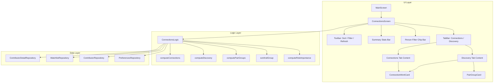

# Design Document: Connections

## Overview

The Connections feature adds a new top-level screen to the app's sidebar navigation that surfaces movies and TV shows where two or more followed contributors overlap. It uses the same TabBar/TabBarView pattern as the Following screen's People/Watchlist tabs, with two tabs:

- **Connections tab** — works already on the user's watchlist with 2+ followed contributors.
- **Discovery tab** — works from contributor filmographies (not on the watchlist) with 2+ followed contributors.

The toolbar (with display options, refresh, and summary stats) and the person filter chip bar sit above the TabBar, shared across both tabs — mirroring how the Following screen's AppBar toolbar sits above its People/Watchlist tabs. Each tab has its own scrollable content area within the TabBarView.

The default tab is Connections. However, if the Connections tab is empty (zero watchlist works with 2+ connections) and the Discovery tab has results, the initial tab index is set to Discovery instead. If both are empty, it stays on Connections. This is computed once during `initState` from the `ConnectionsData` and does not override subsequent user tab selections.

The feature operates entirely on locally cached data (ContributorDetail, WatchlistEntry) and makes zero TMDB API calls during normal use. A manual refresh button triggers the existing `refreshAllContributors()` flow when the user wants fresher data.

The screen includes sorting/grouping options, a person filter chip bar, pair collapsing for Discovery, summary stats, and four distinct TV show presentation cases based on episode-level connection depth.

## Architecture

The feature follows the existing app architecture:

- **State Management**: Flutter Riverpod providers, consistent with the rest of the app.
- **Data Layer**: Reads from Hive-backed repositories (ContributorDetailRepository, WatchlistRepository, ContributorRepository). No new Hive boxes are needed.
- **Logic Layer**: A new `ConnectionsLogic` class encapsulates all connection computation, sorting, filtering, and pair collapsing.
- **UI Layer**: A new `ConnectionsScreen` widget with supporting card widgets, integrated into the `AdaptiveScaffold` via `MainScreen`.
- **Preferences**: New fields on the existing `Preferences` Hive model for persisting sort/group/toggle state.



### Data Flow

1. `ConnectionsScreen` reads followed contributors from `ContributorRepository` and their cached details from `ContributorDetailRepository`.
2. `ConnectionsLogic.computeConnections()` cross-references all works from all ContributorDetail.allWorks lists, building a map of `(tmdbId, WorkType) → Set<ContributorId>`. Works with 2+ contributors that are on the watchlist go to the Connections section.
3. `ConnectionsLogic.computeDiscovery()` takes the remaining works with 2+ contributors (not on watchlist) and applies pair collapsing.
4. Sorting, filtering, and grouping are applied as a final pass before the UI renders.
5. The refresh button calls `ContributorLogic.refreshAllContributors()` with a progress callback, then invalidates the relevant providers to trigger recomputation.

## Components and Interfaces

### New Files

| File | Purpose |
|------|---------|
| `lib/logic/connections_logic.dart` | Core computation: connection counting, sorting, pair collapsing, role importance |
| `lib/ui/screens/connections_screen.dart` | Main screen widget with toolbar, stats bar, chip bar, and two sections |
| `lib/ui/common/connection_work_card.dart` | Work card widget handling all 4 TV cases + movies |
| `lib/ui/common/pair_group_card.dart` | Expandable pair group card for Discovery |

### Modified Files

| File | Change |
|------|--------|
| `lib/ui/screens/main_screen.dart` | Add Connections destination between Home and History (index 1); shift History, Debug, Settings indices |
| `lib/providers/providers.dart` | Add `connectionsLogicProvider` and `connectionsDataProvider` |
| `lib/data/models/preferences.dart` | Add fields for connections sort order, group-by-release toggle, show-hidden-contributors toggle, show-hidden-watchlist toggle |

### ConnectionsLogic Interface

```dart
class ConnectionsLogic {
  final ContributorDetailRepository _detailRepo;
  final WatchlistRepository _watchlistRepo;
  final ContributorRepository _contributorRepo;

  /// Represents a work with its connection metadata.
  /// Built during computation, not persisted.
  /// Contains: work data, list of matched contributors + roles,
  /// connectionCount, highestRoleImportance, standout episodes (for TV).

  /// Compute all connection data from cache.
  /// Returns a ConnectionsData object containing both sections.
  ConnectionsData computeAllConnections({
    required List<Contributor> followedContributors,
    required bool includeHiddenContributors,
    required bool includeHiddenWatchlistItems,
  });
}
```

### ConnectionsData (Computed Result)

```dart
class ConnectionsData {
  final List<ConnectionWork> watchlistConnections;
  final List<DiscoveryItem> discoveryItems; // Union of ConnectionWork and PairGroup
  final List<ContributorSummary> chipBarContributors;
  final ConnectionsStats stats;
}
```

### ConnectionWork (Per-Work Metadata)

```dart
class ConnectionWork {
  final int tmdbId;
  final WorkType type;
  final String title;
  final String? posterPath;
  final DateTime? releaseDate;
  final double? tmdbRating;
  final int? voteCount;
  final List<StreamingOption> streamingOptions;
  final int connectionCount;
  final int highestRoleImportance; // lower = more important
  final List<MatchedContributor> matchedContributors;
  final bool hasImportantRoles; // true if 2+ contributors hold Important_Roles
  final bool isWatched; // true if watchlist entry has Watched status
  final String? status; // TV show status (for release group derivation)
  final DateTime? endDate; // TV show end date
  final int? collectionId; // for collection indicator

  // --- Requirement 16 & 17: Episode-level connection data (TV shows only) ---
  final int? episodeConnectionCount;          // max per-episode contributor count (TV only)
  final int? peakEpisodeSeasonNumber;         // season of the peak episode
  final int? peakEpisodeEpisodeNumber;        // episode number of the peak episode
  final List<EpisodeBreakdownEntry> episodeBreakdown; // full episode drill-down data (TV only)
}
```

### MatchedContributor

```dart
class MatchedContributor {
  final int contributorId;
  final String name;
  final String? profilePath;
  final ContributorType contributorType; // person or company
  final String role; // e.g. "Director", "Actor — Character Name"
  final int roleImportance; // numeric rank for sorting
}
```

### EpisodeBreakdownEntry (Requirement 17)

```dart
/// An episode in the drill-down breakdown, showing ALL contributors
/// (both show-level and episode-specific) — unlike StandoutEpisode which
/// only tracks additional contributors beyond the baseline.
class EpisodeBreakdownEntry {
  final int tmdbId;
  final int? showId;
  final String? showName;
  final int seasonNumber;
  final int episodeNumber;
  final String title;
  final List<MatchedContributor> allContributors; // full contributor list for this episode
  final int connectionCount;                       // total distinct followed people in this episode
  final bool isPeakEpisode;                        // true if this episode drives the Episode_Connection_Count
}
```

### PairGroup

```dart
class PairGroup {
  final MatchedContributor contributor1;
  final MatchedContributor contributor2;
  final List<ConnectionWork> works;
  final int highestRoleImportance;
  final DateTime? mostRecentReleaseDate;
  bool isExpanded; // UI state, default false
}
```

### DiscoveryItem (Union Type)

```dart
/// Sealed class representing either a standalone work or a pair group.
sealed class DiscoveryItem {}

class StandaloneDiscoveryWork extends DiscoveryItem {
  final ConnectionWork work;
}

class PairGroupDiscoveryItem extends DiscoveryItem {
  final PairGroup pairGroup;
}
```

### ConnectionsStats

```dart
class ConnectionsStats {
  final int watchlistCount;
  final int discoveryCount; // pair groups count as 1 each
  final int peopleCount;
  final int pendingCount; // contributors with no cached detail
}
```

### Role Importance Ranking

The `ConnectionsLogic` defines a role importance ranking used for tie-breaking and visual hierarchy:

| Rank | Role Category | Examples |
|------|--------------|----------|
| 0 | Director | Director, Co-Director |
| 1 | Creator | Original Series Creator |
| 2 | Writer | Writer, Screenplay, Teleplay |
| 3 | Producer | Producer, Executive Producer |
| 4 | Lead Cast | Top-billed actors (order ≤ 5 in cast credits) |
| 5 | Supporting Cast | Other cast members |
| 6 | Composer | Original Music Composer |
| 7 | General Crew | All other crew roles |
| 8 | Production Company | Company contributors |

This maps to the existing `CrewConstants` stage system. Director/Writer/Producer map to Stage 1 of their respective departments. Cast order is derived from the `contributorRoles` list position in the Work model (TMDB returns cast in billing order).

A work has `hasImportantRoles = true` when 2+ of its matched contributors hold roles at rank ≤ 4 (Director through Lead Cast).

### Navigation Integration

The `MainScreen` destinations list changes from:

```
[Home (0), History (1), Debug (2), Settings (3)]
```

to:

```
[Home (0), Connections (1), History (2), Debug (3), Settings (4)]
```

The Connections destination uses `Icons.hub_outlined` / `Icons.hub` (outlined/filled pair). The `_screens` list and `selectedTabProvider` are updated accordingly.

### Sorting and Grouping

Two sort modes, matching the Watchlist pattern:

1. **Number of Connections** (default): `connectionCount` descending → `highestRoleImportance` ascending (lower = better) → watched items last.
2. **Release Date**: Grouped by `ReleaseStatusGroup` (TBD, Upcoming, Recently Released, Ongoing, Released, Ended), then sorted by date within each group.

The "Group by Release Status" toggle controls whether release status headers appear. It defaults to off for connection-count sort and on for release-date sort.

Release status derivation for Discovery works (not on watchlist) uses the same temporal thresholds as the Watchlist:
- **TBD**: No release date
- **Upcoming**: Release date in the future
- **Recently Released**: Release date within the past 6 months
- **Ongoing**: TV shows with status "Returning Series" or "In Production"
- **Released**: Movies with past release date (>6 months)
- **Ended**: TV shows with status "Ended" or "Canceled"

### Pair Collapsing Algorithm

Applied during `computeDiscovery()`:

1. For each Discovery work with exactly 2 matched contributors, compute a canonical pair key: `min(id1, id2)_max(id1, id2)`.
2. Group works by pair key.
3. For groups with 3+ works, create a `PairGroup`. Remove those works from the standalone list.
4. Groups with 1–2 works remain as standalone cards.
5. When hidden contributors toggle changes, recompute from step 1.

### Lazy Loading (Discovery)

The Discovery section uses scroll-triggered pagination matching `SearchResultsScreen`:
- Initial render: first 20 items (standalone works + pair groups).
- Scroll trigger: within 300 logical pixels of the bottom.
- Batch size: 20 items.
- A `CircularProgressIndicator` appears at the bottom while preparing the next batch.
- The full computed list is held in memory; pagination only controls how many are rendered.

### Episode-Level Connection Count (Requirement 16)

For TV shows, `connectionCount` changes from "total unique followed contributors across all credits" to "maximum number of distinct followed contributors in any single episode." This better reflects actual co-occurrence.

#### Computation: `_computeEpisodeConnectionCount()`

1. For each episode of the show in the cache, compute the contributor set as the **union** of:
   - Show-level contributors (those credited at the series level, i.e., `trueShowLevelIds` from the existing `_computeStandoutEpisodes` refinement logic)
   - Episode-specific contributors (those credited on that particular episode)
2. The `episodeConnectionCount` is the **maximum** of these per-episode set sizes.
3. Track which episode produced the maximum (the "peak episode") via `peakEpisodeSeasonNumber` and `peakEpisodeEpisodeNumber`.
4. **Fallback**: When a TV show has no episode-level credit data (only show-level credits exist), fall back to `matchedContributors.length` (the total unique show-level count), since episode granularity is unavailable.
5. For TV shows, `connectionCount` on `ConnectionWork` is set to `episodeConnectionCount` (or the fallback). This value is used in all sorting, filtering, threshold checks, and display.

#### Relationship to `_computeStandoutEpisodes()`

The existing `_computeStandoutEpisodes()` method already iterates all episodes and computes per-episode contributor unions. The episode connection count computation reuses the same iteration but extracts the **max** count rather than filtering for episodes exceeding the baseline. Both computations share the same `trueShowLevelIds` refinement and `episodeContributorMap` data, so they can be computed in a single pass.

```dart
// In computeAllConnections(), for TV shows:
final episodeResult = _computeEpisodeData(
  showTmdbId: work.tmdbId,
  showLevelContributorIds: activeContributorsInWork.toSet(),
  episodeContributorMap: episodeContributorMap,
  episodeDataMap: episodeDataMap,
  contributorLookup: contributorLookup,
);
// episodeResult contains:
//   .standoutEpisodes — existing behavior (additional contributors beyond baseline)
//   .episodeConnectionCount — max per-episode count (Req 16)
//   .peakEpisode — (season, episode) of the peak (Req 16.7)
//   .episodeBreakdown — full breakdown entries (Req 17)
```

#### Impact on Existing Behavior

- **Threshold check**: A TV show is included if `episodeConnectionCount >= 1`. TV shows where no followed person appears in any episode are excluded. Shows with `episodeConnectionCount` of 1 (e.g., each followed person in a separate episode) are included but sort toward the bottom. The threshold of 2+ continues to apply to movies only.
- **Sorting**: Uses `episodeConnectionCount` for sort comparisons, so shows with dense per-episode overlap rank higher than shows with spread-out appearances.
- **Stats**: `connectionCount` in stats reflects the episode-level metric.
- **Contributor grouping (Req 18)**: Grouping still uses `matchedContributors` (the full set of all followed people in the show), NOT `episodeConnectionCount`. This preserves correct group formation.

### Episode Drill-Down (Requirement 17)

The episode drill-down is a new expandable section on TV show cards that shows the complete per-episode picture — which followed people appear in which episodes, with full contributor lists (not just the "additional" contributors shown in standout episodes).

#### Computation: `_computeEpisodeBreakdown()`

Computed alongside `_computeStandoutEpisodes()` and `_computeEpisodeConnectionCount()` in the unified `_computeEpisodeData()` method:

1. For each episode, compute the full contributor set (show-level ∪ episode-specific).
2. **Filter**: Only include episodes where the full contributor count ≥ 1 (Req 17.2).
3. For each qualifying episode, build an `EpisodeBreakdownEntry` with:
   - Episode metadata (tmdbId, season, episode, title)
   - `allContributors`: the complete list of followed contributors in this episode, ordered by role importance (persons first, then companies — same as Req 6.5 / Property 10)
   - `connectionCount`: the size of the full contributor set
   - `isPeakEpisode`: true if this episode's count equals the `episodeConnectionCount`
4. **Sort**: By `connectionCount` descending → season ascending → episode ascending (same as standout episodes, Req 17.4).
5. **Hidden contributors**: When the toggle is off, episode contributor sets exclude hidden contributors, and episodes dropping below 1 are omitted (Req 17.11).

#### UI Integration

The episode drill-down coexists with the existing standout episodes section. They serve different purposes:

| Aspect | Episode Drill-Down (Req 17) |
|--------|----------------------------|
| Purpose | Show the *complete* per-episode picture |
| Contributors shown | *All* followed contributors in the episode |
| Threshold | Episode count ≥ 1 |
| Default state | Always collapsed |
| Trigger | User-initiated ("See episodes" action) |

The standout episodes section (Req 5 cases 3 and 4) is removed. The episode drill-down fully replaces it by showing the complete per-episode picture. The `StandoutEpisode` model, `_computeStandoutEpisodes()` logic, and related UI code (`_buildStandoutEpisodes`, `_buildInlineEpisode`, `_buildCollapsibleEpisodes`, `_episodesExpanded` state) are all removed.

On `ConnectionWorkCard`, the episode drill-down is rendered as a separate expandable section below the standout episodes section:

```
┌─────────────────────────────────────────┐
│ [Poster] Title (Year) · Rating          │
│          Streaming logos                 │
│                                         │
│ People: Director A, Actor B, Actor C    │
│                                         │
│ ▸ 12 episodes with connections          │  ← Episode drill-down (collapsed)
│   ┌─────────────────────────────────┐   │
│   │ ★ S02E05 — 4 people            │   │  ← Peak episode highlighted
│   │   Director A, Actor B, C, D    │   │
│   │ S01E03 — 3 people              │   │
│   │   Director A, Actor B, C       │   │
│   │ S03E01 — 1 person              │   │
│   │   Actor B                      │   │
│   └─────────────────────────────────┘   │
└─────────────────────────────────────────┘
```

The `ConnectionWorkCard` has a `_breakdownExpanded` boolean state (default: false). The `_episodesExpanded` state and standout episodes rendering are removed.

The drill-down section header shows the count of qualifying episodes (e.g., "12 episodes with connections"). Tapping an episode row navigates to `TvEpisodeDetailScreen` (same as Req 11.3).

### Contributor Group Integrity (Requirement 18)

The existing `_computeContributorGroups()` method already operates on exact contributor sets of any size — it uses a canonical key of sorted contributor IDs (`ids.join('_')`) and groups works with identical keys. The threshold for collapsing into a group is 2+ works (not 3+ as originally specified for pairs only).

Requirement 18 codifies this behavior and ensures it's preserved as new features are added:

- **Group label**: Updated from "N works together" to include the contributor count: "N people · M works together" (Req 18.2). The `PairGroup` class already has a `contributors` list that supports any size.
- **Superset exclusion**: Already enforced — a work with contributors {A, B, C} has a different canonical key than {A, B}, so it never joins a pair group for A+B.
- **Independence from episode counts**: Grouping uses `matchedContributors` (the full set of all followed people credited on the show at any level), not `episodeConnectionCount`. This is an explicit design decision: a TV show where person A appears in episode 1 and person B appears in episode 2 still has `matchedContributors = {A, B}` and can form a group with other works featuring {A, B}, even though its `episodeConnectionCount` might be 1 (no overlap). The grouping reflects "these people are all involved in this work" while the connection count reflects "these people actually share screen time."

### Person Filter

The chip bar displays contributors sorted by total appearance count (descending). Tapping a chip filters both sections to show only works involving that contributor. When a filter is active and the filtered person is part of a pair group, that pair group auto-expands.

### Add to Watchlist (Discovery)

Uses the existing `HoverActionButton` pattern on the poster. On tap:
- Movies: calls `watchlistLogic.addWorkToWatchlist(...)`, shows `showSimpleSnackBar(context, 'Added "title" to watchlist')`.
- TV shows: calls `watchlistLogic.addWorkToWatchlist(...)`, shows `showTvWatchlistSnackBar(...)` for TV notification preferences.

After adding, the work moves from Discovery to Connections on the next recomputation (triggered by invalidating the watchlist provider).

### Collection Indicator

For movies in either section, check if the work's `tmdbId` appears in any `CollectionOrder` entry in the `collectionOrderRepository`. If so, display a small stacked-rectangles icon on the poster's bottom-right corner with a tooltip showing the collection name.

### Refresh Flow

1. User taps refresh icon in toolbar.
2. Icon is replaced by a linear progress indicator showing `"N / total"`.
3. `ContributorLogic.refreshAllContributors()` is called. The existing method iterates all contributors; we pass a progress callback to update the count.
4. Screen remains interactive during refresh.
5. On completion: invalidate providers, recompute connections, show `showSimpleSnackBar(context, 'Refresh complete')`, update stats bar.
6. On error: show `showSimpleSnackBar(context, 'Refresh failed: ...')`, keep existing data.

## Data Models

### Preferences Extensions

New fields added to the existing `Preferences` Hive model (using next available `@HiveField` indices):

```dart
// In lib/data/models/preferences.dart

@HiveField(26)
String? connectionsSortOrder; // 'connectionCount' or 'releaseDate'

@HiveField(27)
bool? connectionsGroupByRelease; // group by release status toggle

@HiveField(28)
bool? connectionsShowHiddenContributors; // show hidden contributors toggle

@HiveField(29)
bool? connectionsShowHiddenWatchlist; // show hidden watchlist items toggle
```

These follow the same pattern as `watchlistSortOrder` and `watchlistUseListView`.

### No New Hive Models

All computed data (`ConnectionWork`, `PairGroup`, `ConnectionsStats`, etc.) are transient in-memory objects. They are recomputed from cached `ContributorDetail` and `WatchlistEntry` data each time the screen is opened or data changes. There is no need for new Hive boxes or `@HiveType` registrations.

### Existing Models Used

| Model | Usage |
|-------|-------|
| `ContributorDetail` | Source of `allWorks` filmography data per contributor |
| `Work` | Individual work with `contributorRoles`, `streamingOptions`, `tmdbRating`, episode fields |
| `ContributorRole` | Role info within a work (contributorId, role, department, character) |
| `WatchlistEntry` | Watchlist membership check, `isSnoozed`, `statusRecords`, `followedContributors` |
| `Contributor` | Followed contributor list, `isHidden` flag, `type` (person/company) |
| `Preferences` | Persisted display options |
| `CollectionOrder` | Collection membership check for Collection_Indicator |
| `StatusRecord` / `WatchStatus` | Determining "watched" status for sort demotion |

## Correctness Properties

The following properties must hold for any valid output of `ConnectionsLogic`. They are grouped by the invariant they protect and reference the requirements they derive from.

### Property 1: Connection Count Threshold (Req 2.1, 3.1)

Every movie in both the Connections section and Discovery section must have a `connectionCount >= 2`. TV shows must have a `connectionCount >= 1` (since episode-level connection count of 1 is valid for TV shows). No movie with fewer than two matched followed contributors may appear in either section.

```
∀ work ∈ (watchlistConnections ∪ discoveryItems):
  if work.type == movie:
    work.connectionCount ≥ 2
  if work.type == tvShow:
    work.connectionCount ≥ 1
```

### Property 2: Section Disjointness (Req 3.2)

No work appears in both the Connections section and the Discovery section. A work is in Connections if and only if it is on the watchlist; otherwise it is in Discovery (or excluded).

```
watchlistConnections ∩ discoveryStandaloneWorks = ∅
∀ pairGroup ∈ discoveryPairGroups:
  ∀ work ∈ pairGroup.works: work ∉ watchlistConnections
```

### Property 3: Sorting Invariant — Connection Count Mode (Req 2.3, 2.4, 2.7, 3.3, 3.4)

When sorted by "Number of Connections", works must be ordered by `connectionCount` descending, with `highestRoleImportance` ascending as tiebreaker (lower rank = more important). Within any sort group, watched works must appear after all unwatched works.

```
∀ i, j where i < j in sortedList:
  if work[i].isWatched == work[j].isWatched:
    work[i].connectionCount ≥ work[j].connectionCount
    if work[i].connectionCount == work[j].connectionCount:
      work[i].highestRoleImportance ≤ work[j].highestRoleImportance
  else:
    work[i].isWatched == false ∧ work[j].isWatched == true
```

### Property 4: Hidden Contributor Exclusion (Req 14.1, 14.2, 17.11)

When `includeHiddenContributors` is false, no `MatchedContributor` in any displayed work — including episode breakdown entries — may have `isHidden == true`. Connection counts must reflect only visible contributors, and movies whose visible-only count drops below 2 must be excluded. TV shows whose visible-only episode connection count drops to 0 must be excluded. Episode breakdown entries whose per-episode count drops below 1 after excluding hidden contributors must also be omitted.

```
when includeHiddenContributors == false:
  ∀ work ∈ allDisplayedWorks:
    ∀ mc ∈ work.matchedContributors: mc.isHidden == false
    if work.type == movie:
      work.connectionCount == |{mc ∈ work.matchedContributors}| ≥ 2
    if work.type == tvShow:
      work.connectionCount ≥ 1
    ∀ ep ∈ work.episodeBreakdown:
      ∀ mc ∈ ep.allContributors: mc.isHidden == false
      ep.connectionCount ≥ 1
```

### Property 5: Hidden Watchlist Item Exclusion (Req 2.8)

When `includeHiddenWatchlistItems` is false, no work in the Connections section may correspond to a snoozed watchlist entry.

```
when includeHiddenWatchlistItems == false:
  ∀ work ∈ watchlistConnections:
    watchlistEntry(work).isSnoozed == false
```

### Property 6: Contributor Group Formation (Req 4.1, 4.5, 4.7, 18.1, 18.2, 18.3)

A contributor group is formed if and only if 2+ Discovery works share exactly the same set of followed contributors (any size: 2, 3, or N) and no additional contributors. Works with a superset of a group's contributors must never appear inside that group. The grouping logic operates on the full `matchedContributors` set, not limited to pairs.

```
∀ group ∈ discoveryGroups:
  |group.works| ≥ 2
  ∀ work ∈ group.works:
    set(work.matchedContributors) == set(group.contributors)

∀ work with set(work.matchedContributors) ⊃ set(group.contributors):
  work ∉ group.works
```

### Property 7: Group Completeness (Req 4.1, 18.2)

If a canonical contributor-set key has fewer than 2 works, those works must appear as standalone Discovery items, not as a contributor group.

```
∀ groupKey with |worksForKey(groupKey)| < 2:
  ∀ work ∈ worksForKey(groupKey):
    work ∈ discoveryStandaloneWorks
```

### Property 8: (Removed — Standout Episodes Replaced by Episode Breakdown)

The standout episodes feature has been replaced by the Episode Breakdown (Req 17). This property is no longer applicable.

### Property 9: Person Filter Correctness (Req 10.4)

When a Person_Filter is active for contributor C, every work in both sections must include C in its matched contributors.

```
when personFilter == C:
  ∀ work ∈ (watchlistConnections ∪ discoveryItems):
    C ∈ work.matchedContributors
```

### Property 10: Role Importance Ordering Within Cards (Req 6.5, 5.10, 17.10)

Within each work card's people list — and within each episode breakdown entry's contributor list — contributors must be ordered by `roleImportance` ascending (most important first). Company contributors must appear after all person contributors.

```
∀ work ∈ allDisplayedWorks:
  let persons = work.matchedContributors.where(type == person)
  let companies = work.matchedContributors.where(type == company)
  work.matchedContributors == [...persons, ...companies]
  persons is sorted by roleImportance ascending
  companies is sorted by roleImportance ascending

  ∀ ep ∈ work.episodeBreakdown:
    let epPersons = ep.allContributors.where(type == person)
    let epCompanies = ep.allContributors.where(type == company)
    ep.allContributors == [...epPersons, ...epCompanies]
    epPersons is sorted by roleImportance ascending
    epCompanies is sorted by roleImportance ascending
```

### Property 11: Important Roles Flag (Req 6.4)

A work's `hasImportantRoles` flag must be true if and only if 2 or more of its matched contributors hold roles with importance rank ≤ 4 (Director, Creator, Writer, Producer, or Lead Cast).

```
∀ work ∈ allDisplayedWorks:
  importantCount = |{mc ∈ work.matchedContributors : mc.roleImportance ≤ 4}|
  work.hasImportantRoles == (importantCount ≥ 2)
```

### Property 12: Stats Consistency (Req 15.2, 15.4)

The summary stats must accurately reflect the current section contents: watchlistCount equals the length of the Connections section, discoveryCount equals the number of Discovery items (pair groups count as 1), and peopleCount equals the distinct contributors across all displayed works.

```
stats.watchlistCount == |watchlistConnections|
stats.discoveryCount == |discoveryItems|
stats.peopleCount == |⋃ work.matchedContributors for work ∈ allDisplayedWorks|
```

### Property 13: Connection Count Accuracy (Req 2.1, 3.1, 16.1, 16.2)

Each work's `connectionCount` must accurately reflect its contributor overlap. For movies, this equals the number of distinct matched followed contributors. For TV shows with episode data, this equals the `episodeConnectionCount` (max per-episode contributor count). For TV shows without episode data, this falls back to the total distinct show-level contributor count.

```
∀ work ∈ allDisplayedWorks:
  if work.type == movie:
    work.connectionCount == |work.matchedContributors|
  if work.type == tvShow ∧ hasEpisodeData(work):
    work.connectionCount == max(|episodeContributors(ep)| for ep ∈ episodes(work))
  if work.type == tvShow ∧ ¬hasEpisodeData(work):
    work.connectionCount == |work.matchedContributors|
```

### Property 14: Episode Connection Count Computation (Req 16.1, 16.3, 16.6)

*For any* TV show with episode-level credit data, the `episodeConnectionCount` must equal the maximum number of distinct followed contributors (including companies) appearing in any single episode, where each episode's contributor set is the union of show-level contributors and episode-specific contributors.

```
∀ tvShow ∈ allDisplayedWorks where tvShow.type == tvShow ∧ hasEpisodeData(tvShow):
  tvShow.episodeConnectionCount == max over all episodes e of:
    |showLevelContributors(tvShow) ∪ episodeSpecificContributors(e)|
  tvShow.connectionCount == tvShow.episodeConnectionCount
```

**Validates: Requirements 16.1, 16.3, 16.6**

### Property 15: Peak Episode Consistency (Req 16.7, 17.5)

*For any* TV show with an episode breakdown, the peak episode (the one driving `episodeConnectionCount`) must appear in the breakdown and its `connectionCount` must equal the show's `episodeConnectionCount`. Exactly one episode in the breakdown must be marked as `isPeakEpisode = true`.

```
∀ tvShow ∈ allDisplayedWorks where tvShow.episodeBreakdown.isNotEmpty:
  ∃! ep ∈ tvShow.episodeBreakdown: ep.isPeakEpisode == true
  peakEp = tvShow.episodeBreakdown.firstWhere(isPeakEpisode)
  peakEp.connectionCount == tvShow.episodeConnectionCount
  peakEp.seasonNumber == tvShow.peakEpisodeSeasonNumber
  peakEp.episodeNumber == tvShow.peakEpisodeEpisodeNumber
```

**Validates: Requirements 16.7, 17.5**

### Property 16: Episode Breakdown Threshold (Req 17.2, 17.11)

*For any* TV show's episode breakdown, every episode entry must have a per-episode connection count of at least 1. Episodes with zero followed contributors in their combined set (show-level ∪ episode-specific) must be excluded.

```
∀ tvShow ∈ allDisplayedWorks:
  ∀ ep ∈ tvShow.episodeBreakdown:
    ep.connectionCount ≥ 1
    |ep.allContributors| ≥ 1
```

**Validates: Requirements 17.2, 17.11**

### Property 17: Episode Breakdown Sort Order (Req 17.4)

*For any* TV show's episode breakdown, episodes must be sorted by connection count descending, then by season number ascending, then by episode number ascending.

```
∀ tvShow ∈ allDisplayedWorks:
  ∀ i, j where i < j in tvShow.episodeBreakdown:
    ep[i].connectionCount ≥ ep[j].connectionCount
    if ep[i].connectionCount == ep[j].connectionCount:
      ep[i].seasonNumber ≤ ep[j].seasonNumber
      if ep[i].seasonNumber == ep[j].seasonNumber:
        ep[i].episodeNumber ≤ ep[j].episodeNumber
```

**Validates: Requirements 17.4**

### Property 18: Grouping Independence from Episode Counts (Req 18.4, 18.1)

*For any* TV show, its membership in a contributor group must be determined by its full `matchedContributors` set (all followed people credited on the show at any level), not by its `episodeConnectionCount` or per-episode data. Two TV shows with the same `matchedContributors` set must be grouped together even if their `episodeConnectionCount` values differ.

```
∀ work1, work2 ∈ allDisplayedWorks:
  groupKey(work1) == canonicalSort(work1.matchedContributors.map(id))
  groupKey(work2) == canonicalSort(work2.matchedContributors.map(id))
  groupKey(work1) == groupKey(work2) ⟹ sameGroup(work1, work2)
  // groupKey is independent of episodeConnectionCount
```

**Validates: Requirements 18.4, 18.1**

## Error Handling

### Episode Data Gaps

- When a TV show has no episode-level credit data cached, the system falls back to show-level contributor count for `connectionCount`. No error is surfaced — this is expected for shows whose contributor details haven't been fully refreshed yet.
- The `episodeBreakdown` list is empty when no episode data exists. The UI simply hides the drill-down action.
- The `episodeConnectionCount` field is null when no episode data exists; the `connectionCount` field uses the fallback value.

### Inconsistent Episode Data

- If episode data references a contributor ID not in the active contributor set (e.g., a contributor was unfollowed between cache refresh and screen load), that contributor is silently excluded from per-episode counts.
- If an episode's `showId` doesn't match the parent show's `tmdbId`, the episode is skipped during computation (existing behavior in `_computeStandoutEpisodes`).

### Peak Episode Edge Cases

- If multiple episodes tie for the highest per-episode count, the first one in sort order (lowest season, then lowest episode number) is marked as `isPeakEpisode`. Only one episode is marked.
- If the episode breakdown is empty (all episodes have 0 contributors), `peakEpisodeSeasonNumber` and `peakEpisodeEpisodeNumber` are null, and `episodeConnectionCount` falls back to the show-level count.

## Testing Strategy

### Dual Testing Approach

The Connections feature uses both unit tests and property-based tests:

- **Unit tests**: Specific examples, edge cases (TV show with no episode data, single-episode peak, hidden contributor exclusion edge cases), integration points between computation and UI.
- **Property tests**: Universal properties across randomly generated inputs (connection count thresholds, sort invariants, group formation, episode connection count computation).

### Property-Based Testing Configuration

- **Library**: `dart_check` (or `glados` if available in the project's test dependencies — use whichever PBT library is already configured).
- **Iterations**: Minimum 100 per property test.
- **Tag format**: Each test is tagged with a comment referencing the design property:
  ```dart
  // Feature: connections, Property 14: Episode Connection Count Computation
  ```

### New Property Tests for Requirements 16-18

| Property | Test Description | Key Generators |
|----------|-----------------|----------------|
| 14 | Episode_Connection_Count = max per-episode contributor union size | Random TV shows with random episode/show-level contributor assignments |
| 15 | Peak episode in breakdown matches episodeConnectionCount | Same as above, verify isPeakEpisode flag consistency |
| 16 | All episode breakdown entries have connectionCount ≥ 2 | Random TV shows with varying episode contributor counts |
| 17 | Episode breakdown sorted by count desc → season asc → episode asc | Random episode lists, verify sort invariant |
| 18 | Grouping uses matchedContributors, not episodeConnectionCount | Random TV shows with same matchedContributors but different episode data |

### Updated Property Tests

| Property | Change |
|----------|--------|
| 4 | Extended to verify hidden contributor exclusion in episodeBreakdown entries |
| 6 | Generalized from pair-only to any contributor set size |
| 7 | Threshold updated from 3 works to 2 works for group formation |
| 10 | Extended to verify role importance ordering within episodeBreakdown contributor lists |
| 13 | Updated to account for TV show connectionCount using episodeConnectionCount when episode data exists |

### Unit Test Cases for New Requirements

- TV show with 5 followed people each in separate episodes → `episodeConnectionCount` = 1 → included but sorts toward bottom (Req 16.4)
- TV show with no episode data → falls back to show-level count (Req 16.2)
- TV show with 3 people in show-level credits and 1 additional in S02E05 → `episodeConnectionCount` = 4, peak = S02E05 (Req 16.1, 16.7)
- Episode breakdown includes episodes with 1 contributor (Req 17.2)
- Episode breakdown with hidden contributors toggled off drops episodes below 1 (Req 17.11)
- Two TV shows with same `matchedContributors` but different `episodeConnectionCount` values are grouped together (Req 18.4)
- Contributor group with 3 people and 4 works collapses correctly, label shows "3 people · 4 works together" (Req 18.2)
