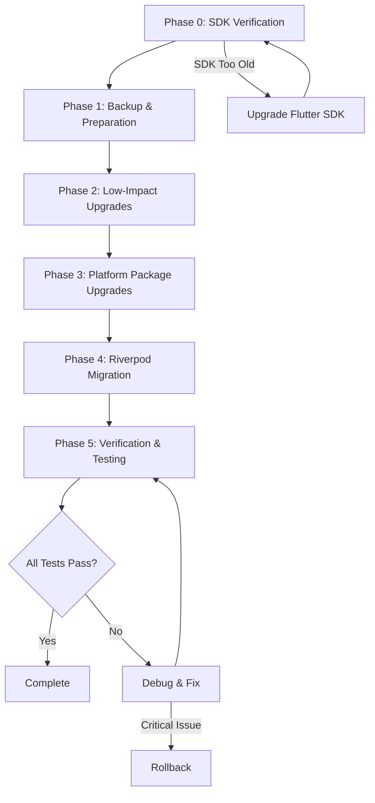

# Design Document: Dependency Upgrade

## Overview

This design document outlines the technical approach for upgrading Flutter dependencies in the Filmmaker Alerts application. The upgrade involves seven packages with major version bumps, with flutter_riverpod 2→3 being the most significant due to breaking API changes affecting state management throughout the application.

The upgrade will be performed in phases, starting with packages that have minimal breaking changes, then progressing to more complex migrations. A rollback strategy ensures the ability to revert if critical issues arise.

**Research Sources:**
- flutter_riverpod changelog: https://pub.dev/packages/flutter_riverpod/changelog
- flutter_local_notifications changelog: https://pub.dev/packages/flutter_local_notifications/changelog
- tray_manager changelog: https://pub.dev/packages/tray_manager/changelog
- window_manager changelog: https://pub.dev/packages/window_manager/changelog
- flutter_dotenv changelog: https://pub.dev/packages/flutter_dotenv/changelog
- intl changelog: https://pub.dev/packages/intl/changelog
- flutter_lints changelog: https://pub.dev/packages/flutter_lints/changelog

## Architecture

### Upgrade Phases



### Phase Breakdown

1. **Phase 0 - SDK Verification**: Verify Flutter SDK version meets requirements (Flutter 3.32+ / Dart 3.8+)
2. **Phase 1 - Backup & Preparation**: Create backups of pubspec.yaml and pubspec.lock
3. **Phase 2 - Low-Impact Upgrades**: flutter_dotenv, intl, flutter_lints
4. **Phase 3 - Platform Package Upgrades**: window_manager, tray_manager, flutter_local_notifications
5. **Phase 4 - Riverpod Migration**: flutter_riverpod (most complex)
6. **Phase 5 - Verification**: Run tests, verify functionality

### SDK Requirements

**CRITICAL**: Several packages require newer Flutter/Dart SDK versions:

| Package | Required SDK |
|---------|-------------|
| flutter_local_notifications 20.0.0 | Dart 3.8 / Flutter 3.32 |
| flutter_lints 6.0.0 | Dart 3.8 / Flutter 3.32 |
| intl 0.20.x | Dart 3.3+ |

**Current pubspec.yaml SDK constraint**: `>=3.0.0 <4.0.0`

**Action Required**: Before upgrading, verify the installed Flutter SDK version:
```bash
flutter --version
```

If Flutter version is below 3.32, either:
1. Upgrade Flutter SDK first: `flutter upgrade`
2. Or use lower package versions that are compatible with current SDK

## Components and Interfaces

### Files Requiring Modification

#### Riverpod Migration (15+ files)

Based on code analysis, the app uses:
- `StateProvider` for UI state: `selectedTabProvider`, `homeTabProvider`, `watchlistScrollTargetProvider`, `fabRaisedProvider`
- `Provider` for repositories and services (no changes needed)
- `FutureProvider` for async data (no changes needed)
- `ConsumerWidget` and `ConsumerStatefulWidget` for UI (no changes needed)
- `ref.watch()`, `ref.read()`, `ref.invalidate()` patterns (no changes needed)

**Migration Strategy for StateProvider:**

Per the official Riverpod 3.0 migration guide (https://riverpod.dev/docs/3.0_migration), there are two options:

**Option A: Use Legacy Import (Minimal Changes)**
```dart
// Before
import 'package:flutter_riverpod/flutter_riverpod.dart';

// After
import 'package:flutter_riverpod/flutter_riverpod.dart';
import 'package:flutter_riverpod/legacy.dart'; // Add this for StateProvider
```

**Option B: Migrate to Notifier (Recommended for new code)**
```dart
// Before
final selectedTabProvider = StateProvider<int>((ref) => 0);
// Usage: ref.read(selectedTabProvider.notifier).state = 1;

// After
@riverpod
class SelectedTab extends _$SelectedTab {
  @override
  int build() => 0;
  
  void set(int value) => state = value;
}
// Usage: ref.read(selectedTabProvider.notifier).set(1);
```

**Recommendation**: Use Option A (legacy import) for this upgrade to minimize changes. The StateProviders in this app are simple UI state holders and don't benefit significantly from migration to Notifier.

| File | Changes Required |
|------|------------------|
| `lib/providers/providers.dart` | Add `import 'package:flutter_riverpod/legacy.dart';` for StateProvider |
| All other files | No changes needed - ref.watch/ref.read/ref.invalidate APIs unchanged |

#### Window/Tray Management (3 files)

Based on changelog analysis, **no code changes required**. The APIs used in the app are unchanged:

| File | Current Usage | Status |
|------|---------------|--------|
| `lib/main.dart` | `windowManager.ensureInitialized()`, `windowManager.show()`, `windowManager.focus()`, `windowManager.setPreventClose()` | ✅ No changes |
| `lib/ui/screens/main_screen.dart` | `WindowListener` interface, `windowManager.addListener()`, `windowManager.isPreventClose()` | ✅ No changes |
| `lib/data/services/system_tray_service.dart` | `TrayListener` interface, `trayManager.setIcon()`, `trayManager.setToolTip()`, `trayManager.setContextMenu()`, `trayManager.popUpContextMenu()` | ✅ No changes |

#### Notifications (1 file)

Based on changelog analysis, **no code changes required** for the upgrade from 18.0.1 to 20.0.0:

| File | Current Usage | Status |
|------|---------------|--------|
| `lib/data/services/notification_service.dart` | `FlutterLocalNotificationsPlugin`, `AndroidInitializationSettings`, `LinuxInitializationSettings`, `InitializationSettings`, `NotificationResponse` | ✅ No changes |

**Note**: The app primarily uses `windows_notification` package for Windows notifications, with `flutter_local_notifications` as fallback for Android/Linux. The core APIs are stable.

#### Environment Loading (4 files)

**Required Change**: Rename `testLoad()` → `loadFromString()`

| File | Current Code | New Code |
|------|--------------|----------|
| `test/data/tmdb_service_test.dart` | `dotenv.testLoad(fileInput: 'TMDB_API_KEY=testkey');` | `dotenv.loadFromString(fileInput: 'TMDB_API_KEY=testkey');` |
| `test/data/tmdb_service_test_draft.dart` | `dotenv.testLoad(fileInput: 'TMDB_API_KEY=testkey');` | `dotenv.loadFromString(fileInput: 'TMDB_API_KEY=testkey');` |
| `test/data/services/tmdb_service_test.dart` | `dotenv.testLoad(fileInput: 'TMDB_API_KEY=test_key');` | `dotenv.loadFromString(fileInput: 'TMDB_API_KEY=test_key');` |

**No changes needed** for production code:
- `lib/main.dart`: `dotenv.load(fileName: ".env")` - unchanged
- `lib/logic/background_service.dart`: `dotenv.load(fileName: ".env")` - unchanged
- `lib/data/services/tmdb_service.dart`: `dotenv.env['TMDB_API_KEY']` - unchanged

#### Linting (1 file)

| File | Changes Required |
|------|------------------|
| `analysis_options.yaml` | May need to suppress new lints if they cause issues |

**New lints in flutter_lints 6.0.0:**
1. `strict_top_level_inference` - Requires explicit types on top-level declarations
2. `unnecessary_underscores` - Flags unused variables with underscore names

**Action**: Run `flutter analyze` after upgrade and address any new warnings.

### Breaking Changes Summary

#### flutter_riverpod 2.6.1 → 3.2.0

**Source:** https://pub.dev/packages/flutter_riverpod/changelog

Confirmed breaking changes from the Riverpod 3.0.0 changelog:

1. **StateProvider/StateNotifierProvider moved to legacy**: 
   - `StateProvider` and `StateNotifierProvider` are moved from `package:flutter_riverpod/flutter_riverpod.dart` to `package:flutter_riverpod/legacy.dart`
   - **Impact**: The app uses `StateProvider` for `selectedTabProvider`, `homeTabProvider`, `watchlistScrollTargetProvider`, `fabRaisedProvider` - these need legacy import or migration

2. **Equality comparison change**: 
   - All providers now use `==` to compare previous/new values and filter updates
   - Can override with `updateShouldNotify` inside Notifiers if needed
   - **Impact**: May affect rebuild behavior if objects don't implement proper equality

3. **Automatic retry for failing providers**: 
   - Failing providers are now automatically retried after a configurable delay
   - **Impact**: May change error handling behavior for FutureProviders

4. **Ref subclasses removed**: 
   - All `Ref` subclasses (like `FutureProviderRef`) are removed - use `Ref` directly
   - For `FutureProviderRef.future`, migrate to using an `AsyncNotifier`
   - **Impact**: Need to check if any code uses specific Ref subclasses

5. **ProviderObserver changes**: 
   - Methods now take `ProviderObserverContext` parameter instead of separate provider+container parameters
   - **Impact**: Only affects code using ProviderObserver (not used in this app)

6. **Disposal behavior change**: 
   - All ref and notifier methods (except `mounted`) now throw if used after disposal
   - **Impact**: May surface bugs in async code that continues after disposal

7. **AsyncValue.value behavior change**:
   - `AsyncValue.value` now returns null during errors
   - `AsyncValue.valueOrNull` is removed (use `.value` instead)
   - **Impact**: Need to check AsyncValue usage patterns

8. **Notifier recreation on rebuild**:
   - Notifier and variants are now recreated whenever the provider rebuilds
   - **Impact**: May affect stateful notifiers (not used in this app)

9. **StreamProvider pausing**:
   - StreamProvider now pauses its StreamSubscription when not actively listened
   - **Impact**: Only affects StreamProvider usage (not used in this app)

#### flutter_dotenv 5.2.1 → 6.0.0

**Source:** https://pub.dev/packages/flutter_dotenv/changelog

Confirmed breaking changes:

1. **Renamed method**: `testLoad()` → `loadFromString()`
   - **Impact**: Test files using `dotenv.testLoad()` must be updated:
     - `test/data/tmdb_service_test.dart`
     - `test/data/tmdb_service_test_draft.dart`
     - `test/data/services/tmdb_service_test.dart`

2. **Empty file handling**: No longer throws when file is empty with `isOptional = true`
   - **Impact**: Minimal - behavior change is more permissive

#### flutter_local_notifications 18.0.1 → 20.0.0

**Source:** https://pub.dev/packages/flutter_local_notifications/changelog

Based on version history (18.0.0 → 19.0.0 → 20.0.0):
- Version 19.0.0 was released ~10 months ago (requires Dart 3.4)
- Version 20.0.0 was released ~4 days ago (requires Dart 3.8)

The changelog shows the breaking changes were primarily in earlier versions (pre-18.0). Recent versions (18.x → 20.x) appear to be incremental improvements and bug fixes. Key considerations:

1. **Minimum SDK requirement**: 20.0.0 requires Dart 3.8 / Flutter 3.32
   - **Impact**: May need to upgrade Flutter SDK first

2. **Windows-specific fixes**: Recent versions include Windows SDK compatibility fixes
   - **Impact**: Should improve Windows notification stability

3. **API stability**: Core initialization and notification APIs appear stable from 18.x
   - **Impact**: Minimal code changes expected if SDK requirements are met

#### window_manager 0.3.9 → 0.5.1

**Source:** https://pub.dev/packages/window_manager/changelog

Confirmed changes from changelog:

**0.4.0:**
- Custom paint icons replace PNG icons
- Removed deprecated `isBezeled` property
- Window size, fullscreen & maximized fixes

**0.5.0:**
- Added `getId` method for retrieving window ID on macOS and Windows
- Added `getWindowHandle` method
- Added Swift Package Manager support
- Fixed crash when using window_manager by multi engine on Windows
- Fixed frameless window fullscreen implementation on Windows
- Fixed minimum size setting in release mode

**0.5.1:**
- Fixed PrivacyInfo.xcprivacy warning for macOS

**Impact on Filmmaker Alerts:**
- Core APIs (`ensureInitialized`, `show`, `hide`, `focus`, `setPreventClose`, `WindowListener`) appear unchanged
- No breaking changes to the methods used in the app
- Should be a straightforward version bump

#### tray_manager 0.2.4 → 0.5.2

**Source:** https://pub.dev/packages/tray_manager/changelog

Confirmed changes from changelog:

**0.3.0:**
- Added `bringAppToFront` param to `popUpContextMenu` method

**0.4.0:**
- Fixed memory leak when updating menu on macOS

**0.5.0:**
- Restore icon and context menu when Explorer restarts (Windows)

**0.5.1:**
- Prevent plugin re-registration when spawning subwindow
- Fixed sandbox check for docker/podman containers
- Fixed memory leak when setting icon multiple times on Windows

**0.5.2:**
- Fixed tray icon disappearing after Explorer restart

**Impact on Filmmaker Alerts:**
- Core APIs (`setIcon`, `setToolTip`, `setContextMenu`, `TrayListener`, `popUpContextMenu`) appear unchanged
- New optional parameter `bringAppToFront` in `popUpContextMenu` - existing code will use default
- Should be a straightforward version bump with improved stability

#### intl 0.19.0 → 0.20.2

**Source:** https://pub.dev/packages/intl/changelog

Confirmed changes from changelog:

**0.20.0:**
- Fixed caching of messages in CompositeMessageLookup
- Type `numberFormatSymbols` as `Map<String, NumberSymbols>`
- Type `dateTimeSymbolMap` as `Map<String, DateSymbols>`
- Fixed issues with AM/PM markers
- Updated to CLDR v44.1, v45
- **Requires Dart ^3.3**
- **Requires package:web ^0.5.0**
- Support compiling to WASM
- RTL detection fix for Kurdish Sorani "ckb"

**0.20.1:**
- Upgraded package:web dependency to 1.1.0
- Updated to CLDR v46

**0.20.2:**
- Removed dependency on package:http
- Removed dependency on package:web

**Impact on Filmmaker Alerts:**
- `DateFormat` API appears stable - no breaking changes to formatting patterns
- Type changes to symbol maps are internal
- Should be a straightforward version bump

#### flutter_lints 5.0.0 → 6.0.0

**Source:** https://pub.dev/packages/flutter_lints/changelog

Confirmed changes from changelog:

**6.0.0:**
- Updates package:lints dependency to version 6.0.0
- **Adds `strict_top_level_inference` lint**
- **Adds `unnecessary_underscores` lint**
- **Requires Flutter 3.32 / Dart 3.8**

**Impact on Filmmaker Alerts:**
- New lint `strict_top_level_inference`: May flag top-level declarations without explicit types
- New lint `unnecessary_underscores`: May flag unused variables with underscore names
- Need to run `flutter analyze` after upgrade and fix/suppress any new warnings

## Data Models

No data model changes are required for this upgrade. All Hive models and data structures remain unchanged.

## Summary of Required Code Changes

Based on thorough research of changelogs and code analysis:

### Minimal Changes Required

| Package | Code Changes | Reason |
|---------|--------------|--------|
| flutter_riverpod 3.2.0 | Add 1 import line | StateProvider moved to legacy.dart |
| flutter_dotenv 6.0.0 | Rename 3 method calls in tests | testLoad() → loadFromString() |
| flutter_local_notifications 20.0.0 | None | APIs unchanged from 18.x |
| window_manager 0.5.1 | None | APIs unchanged |
| tray_manager 0.5.2 | None | APIs unchanged |
| intl 0.20.2 | None | DateFormat API unchanged |
| flutter_lints 6.0.0 | Possibly fix lint warnings | New lint rules may flag existing code |

### Total Estimated Changes

- **1 file** needs import addition (`lib/providers/providers.dart`)
- **3 test files** need method rename (`testLoad` → `loadFromString`)
- **0-N files** may need lint fixes (depends on `flutter analyze` results)

### SDK Requirement

**CRITICAL**: flutter_local_notifications 20.0.0 and flutter_lints 6.0.0 require **Dart 3.8 / Flutter 3.32**.

If current Flutter SDK is older, either:
1. Upgrade Flutter first: `flutter upgrade`
2. Or use compatible versions: flutter_local_notifications ^19.5.0, flutter_lints ^5.0.0

## Correctness Properties

*A property is a characteristic or behavior that should hold true across all valid executions of a system—essentially, a formal statement about what the system should do. Properties serve as the bridge between human-readable specifications and machine-verifiable correctness guarantees.*

### Property 1: Pubspec Dependency Resolution

*For any* valid pubspec.yaml with updated dependency versions, running `flutter pub get` SHALL resolve all dependencies without conflicts.

**Validates: Requirements 2.8**

### Property 2: Riverpod Provider Data Flow Preservation

*For any* provider in the application, after migration to Riverpod 3.x, the provider SHALL return equivalent data when accessed via `ref.watch()` or `ref.read()` as it did before migration.

**Validates: Requirements 3.1, 3.2, 3.3, 3.4, 3.5, 3.6, 8.4**

### Property 3: StateProvider State Mutation Equivalence

*For any* StateProvider, after migration, calling `ref.read(provider.notifier).state = newValue` SHALL update the state and notify listeners equivalently to the pre-migration behavior.

**Validates: Requirements 3.4**

### Property 4: Provider Invalidation Behavior

*For any* call to `ref.invalidate(provider)`, the provider SHALL be marked for refresh and subsequent reads SHALL return fresh data.

**Validates: Requirements 3.6**

### Property 5: Environment Variable Loading Round-Trip

*For any* .env file content, loading via `dotenv.load()` and accessing via `dotenv.env['KEY']` SHALL return the same values before and after the flutter_dotenv upgrade.

**Validates: Requirements 6.1, 6.2, 6.3**

### Property 6: Test Environment Loading Equivalence

*For any* test file using `dotenv.loadFromString(fileInput: content)`, the behavior SHALL be equivalent to the previous `dotenv.testLoad(fileInput: content)` call.

**Validates: Requirements 6.4**

### Property 7: Window Lifecycle Event Handling

*For any* window lifecycle event (show, hide, focus, close), the window_manager SHALL trigger the appropriate WindowListener callback after migration.

**Validates: Requirements 4.1, 4.2, 4.3, 4.6**

### Property 8: System Tray Functionality Preservation

*For any* system tray operation (icon set, tooltip set, menu display, click handling), the tray_manager SHALL behave equivalently after migration.

**Validates: Requirements 4.4, 4.5**

### Property 9: Notification Display Equivalence

*For any* notification request with title, body, and payload, the flutter_local_notifications plugin SHALL display the notification with equivalent appearance and behavior after migration.

**Validates: Requirements 5.1, 5.2, 5.3, 5.4**

### Property 10: Compilation Success

*For any* target platform (Windows, Android), the application SHALL compile without errors after all migrations are complete.

**Validates: Requirements 8.2, 8.3**

### Property 11: Test Suite Passage

*For all* existing unit tests, the tests SHALL pass after migration with only the necessary test code updates (e.g., testLoad → loadFromString).

**Validates: Requirements 8.1**

## Error Handling

### Dependency Resolution Failures

If `flutter pub get` fails after updating pubspec.yaml:
1. Check for version conflicts in error output
2. Try relaxing version constraints (e.g., `^3.0.0` instead of `^3.2.0`)
3. Check if transitive dependencies have conflicts
4. If unresolvable, rollback to previous versions

### Riverpod Migration Errors

If Riverpod migration causes runtime errors:
1. Check for deprecated API usage (StateNotifierProvider, ChangeNotifierProvider)
2. Verify import statements include legacy imports if needed
3. Check for disposal-related errors (methods called after dispose)
4. Add `updateShouldNotify` override if equality comparison causes issues

### Platform Package Failures

If window_manager or tray_manager fail on Windows:
1. Check for API signature changes in listener interfaces
2. Verify initialization order
3. Check Windows-specific error logs
4. Test on clean Windows environment

### Rollback Procedure

If critical issues are discovered:
1. Restore `pubspec.yaml` from backup
2. Restore `pubspec.lock` from backup
3. Run `flutter pub get`
4. Revert any code changes using git
5. Verify application runs correctly

## Testing Strategy

### Dual Testing Approach

This upgrade requires both unit tests and manual verification:

**Unit Tests** (automated):
- Verify provider data flows correctly
- Verify environment variable loading
- Verify date formatting with intl
- Run existing test suite to catch regressions

**Manual Testing** (required for platform features):
- Windows: Minimize to tray, restore from tray, close behavior
- Windows: System tray icon, tooltip, context menu
- Notifications: Display on Windows and Android
- General: Application startup, navigation, data persistence

### Test Execution Order

1. Run `flutter analyze` to check for lint errors
2. Run `flutter test` to execute unit tests
3. Run `flutter build windows` to verify Windows compilation
4. Run `flutter build apk` to verify Android compilation
5. Manual testing of platform-specific features

### Property-Based Testing Configuration

For properties that can be automated:
- Use existing test framework (flutter_test)
- Minimum 100 iterations for any randomized tests
- Tag tests with property references: `// Feature: dependency-upgrade, Property N: description`

### Test Files Requiring Updates

| Test File | Required Change |
|-----------|-----------------|
| `test/data/tmdb_service_test.dart` | `testLoad` → `loadFromString` |
| `test/data/tmdb_service_test_draft.dart` | `testLoad` → `loadFromString` |
| `test/data/services/tmdb_service_test.dart` | `testLoad` → `loadFromString` |

### Verification Checklist

- [ ] `flutter pub get` succeeds
- [ ] `flutter analyze` shows no errors
- [ ] `flutter test` passes all tests
- [ ] `flutter build windows` succeeds
- [ ] `flutter build apk` succeeds
- [ ] App launches on Windows
- [ ] Minimize to tray works
- [ ] Restore from tray works
- [ ] System tray context menu works
- [ ] Notifications display correctly
- [ ] Provider state updates correctly
- [ ] Navigation between screens works
- [ ] Data persists across app restarts
